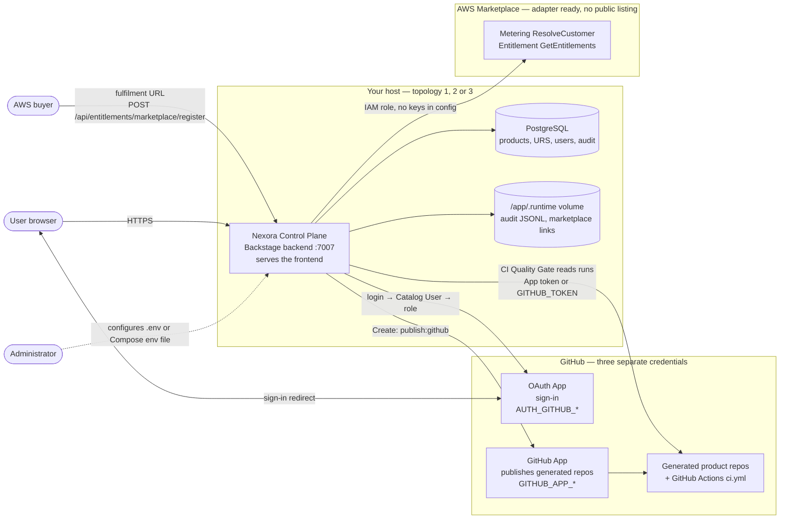

<p align="center">
  
</p>

<h1 align="center">Nexora</h1>

<p align="center">
  <strong>Nexora</strong> Control Plane for governed Data Products
  in life science manufacturing.
</p>

**Nexora** is the product name. **NEXORA** is the wordmark. **Pharma Data
Factory** is the product line: a commercial Control Plane for small and
mid-sized life science teams (pharma, biotech, and CDMO/CMO). Developers discover, create,
and operate Data Products around existing ERP, MES, LIMS, EWM, and other
IT/OT systems of record — without building an Internal Developer Platform
from scratch.

The Control Plane is built on [Backstage](https://backstage.io) **1.53.0**
(Apache-2.0). Backstage is the framework, not the product. Generated Data
Products run independently of the Control Plane.

|                         |                                                                                      |
| ----------------------- | ------------------------------------------------------------------------------------ |
| Product name            | Nexora                                                                               |
| Wordmark                | NEXORA                                                                               |
| Product line            | Nexora                                                                               |
| Brand mark              | Hexagonal N mark (`docs/brand/nexora-lockup.svg`, `packages/app/public/favicon.svg`) |
| Baseline                | MVP 1.0                                                                              |
| Technical status        | TECHNICAL_MVP_COMPLETE                                                               |
| Commercial distribution | BLOCKED pending counsel-approved LICENSE / NOTICE                                    |
| GxP / CSV               | Not validated. CERTIFIED is technical conformance only.                              |

This repository is standalone. It does not reuse or connect to unrelated
corporate platforms.

---

## Installation for administrators

This section is here, rather than in the in-app help, because the in-app help
is unreadable until the platform runs. Nexora has three parts — **frontend**,
**backend**, **PostgreSQL** — and three ways to place them:

| Topology                                       | Frontend                | Backend              | PostgreSQL            | Use it for                              | Start                                              |
| ---------------------------------------------- | ----------------------- | -------------------- | --------------------- | --------------------------------------- | -------------------------------------------------- |
| **1 — All in Docker, one container**           | served by the backend   | container            | container             | Evaluation, pilots, any shared instance | `./start.sh` or `docker compose up --build nexora` |
| **2 — All in Docker, separate containers**     | nginx container on 3000 | container            | container             | Testing a reverse-proxy layout          | `docker compose --profile split up`                |
| **3 — Workspace, only the database in Docker** | Node process on 3000    | Node process on 7007 | container             | Development with hot reload             | `docker compose up -d db`, then `yarn start`       |
| Production                                     | served by the backend   | published image      | container or external | Deployment                              | `yarn prod:env && yarn docker:prod:up`             |

Choose **1** unless you are changing code. It is what the production image
does: one origin on `:7007`, no CORS, no `.env` required.

**Every topology needs PostgreSQL.** In topology 3 the database is the one
part that does not start by itself: after a workspace or machine restart,
start it again with `docker compose up -d db` (or `docker start nexora-db-1`)
**before** `yarn start`. If you skip that, the frontend still loads on 3000,
but the backend stays at `"Backend has not started yet"` indefinitely, every
API route returns 404, and the log shows `Failed to connect to the database`
for each plugin. To run without any database, layer `app-config.memory.yaml`
on top of `app-config.yaml` and read what that file says you give up.

Behind a remote gateway (Ona, Gitpod, Codespaces) the split 3000/7007 layout
of topology 3 cannot sign you in; use the single-origin mode in
[Remote gateways](#remote-gateways-ona-gitpod-codespaces).

Step-by-step procedures, variables and troubleshooting for each topology:
**[START.md](START.md)**.

### How the parts connect



Three things this picture is meant to make obvious:

- **GitHub plays three roles, each with its own credential.** The **OAuth App**
  signs people in and is required for every non-Guest login. The **GitHub App**
  publishes the repositories that _Create_ generates, and must be installed on
  the target organization (`GITHUB_ORG`, default `pharma-data-factory`).
  `GITHUB_TOKEN` is an optional personal-token fallback for catalog reads and
  the CI Quality Gate. Without any of them the portal still runs; only sign-in,
  publishing and CI status are missing. Setup: [GitHub setup](#github-setup),
  [docs/github-setup.md](docs/github-setup.md).
- **A GitHub login is not access.** Sign-in proves identity; the role comes
  from the Nexora user record (`/admin/users`, stored in PostgreSQL). An unknown
  login authenticates and lands on "Access not granted". On a fresh production
  install set `USERS_BOOTSTRAP_ADMIN=<github-login>` in the environment file, or nobody
  can open `/admin/users` to add the next person.
- **The in-app Marketplace is not AWS Marketplace.** The Marketplace page is a
  technical catalog of approved assets, fed by `catalog/artifacts/` and
  `catalog/editions.yaml` (artifact-registry-backend); it needs no setup
  beyond those files. **AWS Marketplace** is an optional entitlement source:
  the adapter (`plugins/entitlements-backend`) resolves buyers and reads
  entitlements, an administrator approves each buyer link in
  `/admin/marketplace-integration`, and there is no metering and no public
  listing yet. Enable it only with `app-config.marketplace-test.yaml` and the
  `AWS_MARKETPLACE_*` variables —
  [docs/aws-marketplace-test-listing.md](docs/aws-marketplace-test-listing.md).

---

## What the platform does

Nexora keeps core systems standard, composes certified capabilities, and
delivers independently versioned Data Products.

| Capability   | What you get                                                        |
| ------------ | ------------------------------------------------------------------- |
| **Discover** | Catalog, Marketplace, TechDocs, ownership, APIs, dependencies       |
| **Create**   | Golden Path templates, GitHub repository, source, Docker, tests, CI |
| **Deliver**  | GitHub Actions quality gate, contracts, compatibility, versioning   |
| **Operate**  | Lifecycle metadata, documentation, RBAC, certification status       |

Official Golden Path:

```text
Marketplace → MQTT Temperature, REST Equipment, or OEE
  → Configure parameters → Generate → GitHub repository
  → GitHub Actions → Tests → Docker build
  → Catalog → Data Products → Contract / TechDocs / CI quality gate
```

ERP, MES, LIMS, EWM, historians, and similar systems remain the systems of
record. The Control Plane does not replace them and does not connect to
those databases directly.

---

## Architecture

### Backstage is the kernel, not the product

The Control Plane runs on Backstage 1.53.0. Backstage contributes the plugin
runtime, the software catalog, the scaffolder engine, TechDocs, search and
the permission framework. Everything that makes this Nexora — the Data
Product model, Golden Paths, certification, entitlements, URS Composer and
Validation Expert — is Nexora-owned code in `packages/` and `plugins/`.

No `@backstage/*` package is patched and `node_modules` is never modified.
Backstage is extended through its public extension points, which keeps
upgrades tractable.

### Layers

```text
┌──────────────────────────────────────────────────────────────┐
│  packages/app          Frontend — landing page, Control Plane │
│  plugins/*             Feature plugins (frontend + backend)   │
├──────────────────────────────────────────────────────────────┤
│  packages/backend      Backstage backend host, plugin wiring  │
│  packages/platform-common   Domain model, shared by both      │
├──────────────────────────────────────────────────────────────┤
│  Backstage 1.53.0      Catalog · Scaffolder · TechDocs ·      │
│                        Search · Permissions · Auth            │
└──────────────────────────────────────────────────────────────┘
```

`packages/platform-common` is the lowest Nexora layer: the Data Product
model, roles and permissions, URS types, release and compatibility rules. It
is framework-agnostic and must not depend on UI packages — the dependency
runs the other way. Domain code therefore names a _meaning_ (a status tone,
a role) and the presentation layer decides how it looks.

### Catalog-native by design

Data Products, Platform Components, APIs and Templates are ordinary Backstage
catalog entities annotated with `dataprod.platform/*`. Relationships use
native `dependsOn`, `providesApis` and `consumesApis` rather than a parallel
graph, so Catalog Graph, search and TechDocs work without custom code.

### Generated products are independent

A generated Data Product is a standalone repository with its own source,
tests, Dockerfile, CI workflow and contract. It does not import Nexora code
at runtime and does not call back to the Control Plane. The Control Plane
scaffolds and catalogs it; the product then runs on its own.

### Authorization

Requests are decided in the backend permission policy, never only in the UI.
Group membership maps to a platform role, and the role maps to a permission
set: `ownershipEntityRefs` → `GROUP_TO_ROLE` → `permissionsForRole` →
`decidePermission` (`packages/platform-common/src/policy.ts`). A user outside
every platform group has no access, which is the fail-closed default.

Details: [docs/architecture.md](docs/architecture.md),
[docs/identity-and-rbac.md](docs/identity-and-rbac.md).

---

## Official Golden Paths

| Golden Path                   | Catalog name                    | Technical status     | Commercial availability  |
| ----------------------------- | ------------------------------- | -------------------- | ------------------------ |
| MQTT Temperature Data Product | `mqtt-temperature-data-product` | CERTIFIED / RELEASED | Pilot (legal gates OPEN) |
| REST Equipment Data Product   | `rest-equipment-data-product`   | CERTIFIED / RELEASED | Pilot (legal gates OPEN) |
| OEE Data Product              | `oee-data-product`              | CERTIFIED / RELEASED | FUTURE                   |

CERTIFIED means the template conforms to Data Product Standard 1.0.x. It
is not GxP validation and not a sales SKU.

Python Microservice, Node.js Microservice, and MQTT Connector are general
service templates, not Data Product Golden Paths.

---

## Create parameters

Create collects a small set of business fields. Secrets and runtime URLs
are never entered in the form. They belong in the generated service
environment after publish.

### Shared (all official Data Product templates)

| Parameter             | Required | Meaning                                                                                                 |
| --------------------- | -------- | ------------------------------------------------------------------------------------------------------- |
| **Data Product Name** | Yes      | Lowercase letters, digits, and dashes (`^[a-z0-9]+(-[a-z0-9]+)*$`). Becomes the GitHub repository name. |
| **Description**       | Yes      | Short product description.                                                                              |
| **Owner**             | Yes      | Catalog User or Group. Not the GitHub organization.                                                     |
| **GitHub Repository** | Yes      | Created in `pharma-data-factory` by the platform GitHub App. Enter the repository name only.            |

Fixed by the template (not asked on Create): GitHub host `github.com`,
organization `pharma-data-factory`, private repository, default branch
`main`, system `data-platform`, initial version `1.0.0`.

### MQTT Temperature

| Parameter      | Default                | Meaning                                             |
| -------------- | ---------------------- | --------------------------------------------------- |
| **MQTT Topic** | `pharma/temperature/+` | Subscription topic. `+` is a single-level wildcard. |

Domain is manufacturing.

### REST Equipment

| Parameter  | Default         | Meaning                               |
| ---------- | --------------- | ------------------------------------- |
| **Domain** | `manufacturing` | Business domain for catalog metadata. |

The REST source URL is a runtime environment variable on the generated
service, not a Create field.

### OEE Data Product

| Parameter                            | Default          | Meaning                                                                                       |
| ------------------------------------ | ---------------- | --------------------------------------------------------------------------------------------- |
| **Domain**                           | `manufacturing`  | Business domain.                                                                              |
| **Equipment Identifier**             | `filler-01`      | Canonical `equipmentId` on every OEE input and result.                                        |
| **Default Time Window**              | `hour`           | `hour`, `day`, `shift`, `order`, or `custom`. `CURRENT_SHIFT` requires from/to at query time. |
| **MQTT Topic Pattern**               | `pharma/oee/+/+` | Machine, count, and quality events.                                                           |
| **Production Context URL Reference** | `SOURCE_API_URL` | **Name** of the env var that will hold the MES REST URL. Do not paste the URL or a secret.    |

OEE architecture is fixed: counter convention CUMULATIVE; Wave 1 MQTT
Consumer and REST Source; OEE contract 1.0.0.

### Python Microservice (not a Golden Path)

Service Name, Description, Owner, GitHub repository name. Same naming
rules as Data Products.

Full template notes: [docs/templates.md](docs/templates.md).

---

## Runtime and Control Plane parameters

Write `.env` by hand — see [Environment file](#environment-file) for why
copying the example breaks startup. Never commit `.env`.

| Variable group                                                                                                 | Purpose                                                                                              |
| -------------------------------------------------------------------------------------------------------------- | ---------------------------------------------------------------------------------------------------- |
| `AUTH_GITHUB_CLIENT_ID` / `AUTH_GITHUB_CLIENT_SECRET` / `AUTH_GITHUB_CALLBACK_URL`                             | GitHub **OAuth App** for human login (`Ov23…`). Callback: `{backend}/api/auth/github/handler/frame`. |
| `GITHUB_APP_ID` / `GITHUB_CLIENT_ID` / `GITHUB_CLIENT_SECRET` / `GITHUB_PRIVATE_KEY` / `GITHUB_WEBHOOK_SECRET` | GitHub **App** for publishing generated repositories (`Iv23…`). Do not mix with OAuth login.         |
| `GITHUB_ORG`                                                                                                   | Target organization (default `pharma-data-factory`).                                                 |
| `APP_BASE_URL` / `BACKEND_BASE_URL` / `BACKEND_SECRET`                                                         | Hosted Control Plane URLs and backend cookie secret. Leave empty for local `yarn start`.             |
| `POSTGRES_*`                                                                                                   | Docker Compose / hosted PostgreSQL. Local Compose uses documented local-only defaults.               |
| `AWS_MARKETPLACE_*`                                                                                            | Optional procurement integration. Empty for local development. Not a public listing.                 |
| `LEGAL_DISTRIBUTION_STATUS`                                                                                    | Operational flag. Default **BLOCKED** until counsel approves LICENSE / NOTICE.                       |

OAuth App client IDs start with `Ov23`. GitHub App client IDs start with
`Iv23`. Mixing them breaks login or publish.

Local: [docs/github-setup.md](docs/github-setup.md),
[docs/identity-and-rbac.md](docs/identity-and-rbac.md).  
Hosted: [docs/deployment/portainer.md](docs/deployment/portainer.md).

---

## License and third-party notices

**This product is not open source.** Custom Control Plane code (plugins,
UI, templates, `platform-common`, generated-product SDK) is declared
`UNLICENSED` / private. There is no outbound license for the Nexora code
itself.

The Apache-2.0 attribution artifacts required when redistributing Backstage
are prepared but **not yet counsel-approved**:

- `NOTICE` — Backstage attribution (The Backstage Authors; originally
  developed at Spotify AB; CNCF project; "Backstage" is a trademark of The
  Linux Foundation).
- `licenses/Apache-2.0.txt` — full Apache License 2.0 text.
- `THIRD_PARTY_NOTICES.md` — third-party inventory (DRAFT).

Counsel review is required before commercial distribution, Template
Edition packaging, or publishing final legal pages.

| Layer                   | Status                                                                                                                                                         |
| ----------------------- | -------------------------------------------------------------------------------------------------------------------------------------------------------------- |
| Nexora original code    | Proprietary. `license: UNLICENSED`. Distribution blocked until counsel approves outbound terms. Nexora and Nexora are product names, not an open-source grant. |
| Backstage 1.53.0        | [Apache License 2.0](https://github.com/backstage/backstage/blob/master/LICENSE). Apache-2.0 does not grant trademark rights in Backstage®.                    |
| Upstream NOTICE         | [The Backstage Authors](https://github.com/backstage/backstage/blob/master/NOTICE) plus third-party portions.                                                  |
| Generated Data Products | Independent FastAPI services. Outbound LICENSE / NOTICE / third-party notices are counsel-gated placeholders, not invented here.                               |
| Public legal pages      | `/legal`, `/privacy`, `/terms`, `/open-source` are review placeholders, not binding terms.                                                                     |

Final OSS attribution and distribution approval require the Phase 0
counsel gates to be APPROVED. Until then, do not treat this README as a
license grant.

Commercial editions (Template / Platform / SaaS): [docs/commercial-model.md](docs/commercial-model.md).
List prices are not published.

---

## Getting started

**Prerequisites.** Node.js 22 or 24, Yarn 4 via Corepack, Docker Compose for
the container path. The devcontainer provides both; rebuild it after pulling
`.devcontainer/devcontainer.json`.

```bash
corepack enable
yarn install
yarn tsc
docker compose up -d db   # PostgreSQL; repeat after every workspace restart
yarn start
```

Frontend on **3000**, backend on **7007**, database in Docker on **5432** —
topology 3 in [Installation for administrators](#installation-for-administrators). `yarn start` runs `scripts/ona-dev.sh start`, which honours the sign-in flags
in `.env` (see [Sign-in](#sign-in)); `yarn start:raw` is the bare command for
shells without bash. Either reads `.env` through
`node --env-file`, so the file must exist.

### Environment file

Write `.env` by hand. Do not copy `.env.example`, which lists every supported
variable with an empty value for reference.

> Backstage omits a config key whose `${VAR}` is **unset**, but rejects it
> with `got empty-string, wanted string` when the variable is set and empty.
> A variable you do not have must be absent, not empty.

Copying the example therefore sets `GITHUB_TOKEN=`, `COMPOSER_AI_KEY=` and
others to empty strings, and catalog, scaffolder, techdocs and data-products
all fail to start. The minimum that works:

```bash
printf 'BACKEND_SECRET=dev-local-auth-key\n' > .env
```

`.env` is read once at process start; changes require a restart. Backend
source changes reload automatically.

### Sign-in

GitHub login is the default and requires an OAuth App — see
[GitHub setup](#github-setup).

Guest sign-in is opt-in and local-only:

| Variable                    | Effect                                                                                                     |
| --------------------------- | ---------------------------------------------------------------------------------------------------------- |
| `AUTH_GUEST_ENABLED=true`   | Shows **Continue as Guest**                                                                                |
| `AUTH_GUEST_ROLE=viewer`    | Read-only (default)                                                                                        |
| `AUTH_GUEST_ROLE=developer` | Additionally permits scaffolding, create, and URS authoring                                                |
| `AUTH_DEMO_ENABLED=true`    | **Test system:** one sign-in per approval role — `demo-author`, `demo-reviewer`, `demo-pm`, `demo-quality` |

Guest resolves to **VIEWER**: catalog, marketplace and data-product read
access, no scaffolding, no create. Raising it to `developer` is a deliberate
local escalation. Guest is unavailable in production, where
`auth.environment: production` applies.

`developer` does **not** grant URS approval. Each approval step requires its
own role and no role bypasses the check, so a chain one identity can walk alone
would prove nothing. To walk it on a test system, set `AUTH_DEMO_ENABLED=true` and restart; `yarn start`
and `scripts/ona-dev.sh serve` both read the flag from `.env`. Each seat holds one approval role, so the chain
still needs four different sign-ins. Alternatively, uncomment the three
`urs-*-reviewers` groups in `app-config.guest-developer.yaml` — and treat the
resulting signatures as worthless evidence, because they are.

### GitHub setup

Two distinct GitHub applications serve two different purposes.

|            | Purpose                           | Client ID | Variables                                               |
| ---------- | --------------------------------- | --------- | ------------------------------------------------------- |
| OAuth App  | Portal login                      | `Ov23…`   | `AUTH_GITHUB_*`                                         |
| GitHub App | Publishing generated repositories | `Iv23…`   | `GITHUB_APP_*`, `GITHUB_CLIENT_*`, `GITHUB_PRIVATE_KEY` |

**OAuth App.** GitHub → Settings → Developer settings → OAuth Apps → New
OAuth App.

| Field                      | Value                                               |
| -------------------------- | --------------------------------------------------- |
| Homepage URL               | Base URL, e.g. `http://localhost:3000`              |
| Authorization callback URL | Backend base URL + `/api/auth/github/handler/frame` |

The callback must match exactly, including the path, or GitHub returns
`redirect_uri_mismatch`. Behind a gateway it is the forwarded 7007 URL rather
than localhost; `scripts/ona-dev.sh expose` prints the value to use. Generate
a client secret, set `AUTH_GITHUB_CLIENT_ID`, `AUTH_GITHUB_CLIENT_SECRET` and
`AUTH_GITHUB_CALLBACK_URL`, then restart.

A backend log line `Skipping github auth provider` means the client ID is
missing; `/api/auth/github/start` then returns 404.

Sign-in maps the GitHub login to the Catalog user of the same name in
`catalog/users.seed.yaml`, which determines the role. An unknown login
authenticates but receives no platform group and reaches the access-denied
page.

**GitHub App.** Required only for Create to publish. A GitHub App creates
repositories in an organization, never on a personal account. Permissions and
installation: [GitHub configuration](docs/github-setup.md).

Without either application the portal still runs; only sign-in and publishing
are unavailable.

### Remote gateways (Ona, Gitpod, Codespaces)

Serving the frontend and backend on two forwarded hostnames does not work:
the browser treats the API host as cross-origin, withholds the gateway
session cookie, and the gateway returns 401 without CORS headers. Use a
single origin, as the production image does.

```bash
scripts/ona-dev.sh expose    # opens 7007, writes the forwarded URLs
yarn workspace app build     # the backend serves this bundle
scripts/ona-dev.sh serve     # single origin on 7007
```

`scripts/ona-dev.sh start` retains the two-port dev server with hot reload
for work inside the container. In `serve` mode a frontend change requires a
rebuild. `.gitpod/automations.yaml` defines both; apply it once with
`ona environment config apply -s .gitpod/automations.yaml`.

### Contributing changes

Pushing requires a token with **Contents: Read and write** for this
repository. A fine-grained token must also list the repository under
_Repository access_; "Public repositories (read-only)" cannot push even when
the account is a repository admin, and the resulting 403 resembles an
organization permission problem.

```bash
gh api repos/<owner>/<repo> --jq .permissions
```

### Docker

See **[START.md](START.md)** for all four ways to run the platform and which
one to pick. The short version:

```bash
yarn build:backend            # required — the image copies the bundle, it does not build it
docker compose up --build nexora
```

Compose starts PostgreSQL and the Control Plane on one origin:
http://localhost:7007, where the backend also serves the built frontend. The
split 3000/7007 layout is `--profile split` and is not the default.

`yarn build:backend` is not optional: `packages/backend/Dockerfile` copies
`packages/backend/dist/skeleton.tar.gz` and `bundle.tar.gz` into the image.
Without it the build fails on a missing file.

Local `yarn start` uses PostgreSQL from `app-config.yaml` and expects it on
`localhost:5432`; `docker compose up -d db` provides it. Do not deploy the root `Dockerfile` as production. Production image:
`packages/backend/Dockerfile`. Hosted: [Portainer](docs/deployment/portainer.md).
Production smoke checklist: [Docker production](docs/deployment/docker-production.md).

The production path does **not** use `.env` — that is a development
mechanism. It reads a Compose environment file instead, and the same
`docker-compose.production.yml` backs the Portainer stack.

```bash
yarn prod:env            # writes deploy/production.local.env, any platform
yarn docker:prod:build
yarn docker:prod:up
yarn docker:prod:logs
```

`yarn prod:env` generates a throwaway RSA key so Octokit can parse
`GITHUB_APP_*` at boot; sign-in and publishing still need real credentials.
Windows users can run `.\scripts\prepare-production-local-env.ps1` and
`yarn docker:prod:build:win` instead.

Required variables are listed in `deploy/portainer.env.example`. The
empty-value rule from above applies here too: do not carry
`GITHUB_TOKEN=`, `GHE_TOKEN=`, `COMPOSER_AI_API_KEY=` or `URS_AI_API_KEY=`
into a production environment file. `POSTGRES_HOST` and `POSTGRES_PORT` are
supplied by Compose and belong in the file only when running the image
against an external database.

### Configuration files

Backstage merges every `--config` file in order; a later file overrides an
earlier one. Secrets never go into these files — they reference environment
variables (`${VAR}`), which come from `.env` in development and from a Compose
environment file in production. **What an administrator edits is almost always
the environment, not the YAML.** The YAML is changed only for the few literal
values marked below.

**Which files each way of starting loads**

| Start command                        | Files, in merge order                                                                                                                                          |
| ------------------------------------ | -------------------------------------------------------------------------------------------------------------------------------------------------------------- |
| `yarn start`                         | `app-config.yaml`, `app-config.local.yaml`                                                                                                                     |
| `scripts/ona-dev.sh start` / `serve` | the two above, then by `.env` flag: `.guest` (`AUTH_GUEST_ENABLED=true`), `.guest-developer` (`AUTH_GUEST_ROLE=developer`), `.demo` (`AUTH_DEMO_ENABLED=true`) |
| `docker compose up nexora`           | `app-config.yaml`, `.production`, `.docker-local`                                                                                                              |
| Production image                     | `app-config.yaml`, `.production`, `.github`                                                                                                                    |

**What each file is for**

| File                               | Purpose                                                                                              | What you set                                                                                                                                                      | Production |
| ---------------------------------- | ---------------------------------------------------------------------------------------------------- | ----------------------------------------------------------------------------------------------------------------------------------------------------------------- | ---------- |
| `app-config.yaml`                  | Base for every environment: PostgreSQL, GitHub login, catalog, plugins, commercial defaults          | Env: `BACKEND_SECRET`, `POSTGRES_*`, `AUTH_GITHUB_*`, optional `GITHUB_TOKEN`, AI keys, `GITHUB_ORG` — the GitHub org Create publishes into | Base       |
| `app-config.local.yaml`            | Local developer overrides; contains a fixed dev auth key                                             | Optional `COMPOSER_AI_KEY`                                                                                                                                        | No         |
| `app-config.guest.yaml`            | Adds **Continue as Guest** (read-only VIEWER)                                                        | Nothing — switched on by `AUTH_GUEST_ENABLED=true`                                                                                                                | No         |
| `app-config.guest-developer.yaml`  | Raises Guest to DEVELOPER (scaffold, create, URS authoring; never approval)                          | Nothing — `AUTH_GUEST_ROLE=developer`                                                                                                                             | No         |
| `app-config.demo.yaml`             | **Test system:** one sign-in per approval role — author, business reviewer, product manager, quality | Nothing — `AUTH_DEMO_ENABLED=true`. Refused under `auth.environment: production`                                                                                  | No         |
| `app-config.github.yaml`           | GitHub App for publishing generated repositories                                                     | `GITHUB_APP_ID`, `GITHUB_CLIENT_ID`, `GITHUB_CLIENT_SECRET`, `GITHUB_PRIVATE_KEY`, optional `GITHUB_WEBHOOK_SECRET`                                               | **Yes**    |
| `app-config.production.yaml`       | Hosted profile: production auth (Catalog users only, no Guest), permissions on, rate limit           | `APP_BASE_URL`, `BACKEND_BASE_URL`, `AUTH_GITHUB_CALLBACK_URL`, optional `NEXORA_PROVENANCE_TOKEN`. `USERS_BOOTSTRAP_ADMIN` for the first admin                   | **Yes**    |
| `app-config.docker-local.yaml`     | Guest-only override for the local Compose stack                                                      | Nothing                                                                                                                                                           | No         |
| `app-config.docker.yaml`           | Profile for the root `Dockerfile` dev image                                                          | `POSTGRES_*`, `AUTH_GITHUB_*` — nothing in Compose or CI uses it                                                                                                  | No         |
| `app-config.memory.yaml`           | Run without any database; the file lists what you give up                                            | Nothing — add it by hand                                                                                                                                          | No         |
| `app-config.marketplace-test.yaml` | AWS Marketplace **test** entitlements instead of local ones                                          | `AWS_MARKETPLACE_REGION`, `AWS_MARKETPLACE_PRODUCT_CODE`, `AWS_MARKETPLACE_LINK_STORE_PATH`, `LEGAL_DISTRIBUTION_STATUS`                                               | No         |
| `app-config.e2e.yaml`              | Backend serves the built frontend for Playwright; layered on `.demo`                                 | `POSTGRES_*`                                                                                                                                                      | No         |
| `app-config.service-token.yaml`    | Static local service-principal token for API experiments                                             | Nothing                                                                                                                                                           | Never      |

**Other root files an administrator meets**

| File                            | Purpose                                                                                                                                  |
| ------------------------------- | ---------------------------------------------------------------------------------------------------------------------------------------- |
| `.env` / `.env.example`         | Development environment, read by `yarn start` and `scripts/ona-dev.sh`. Write `.env` by hand — see [Environment file](#environment-file) |
| `docker-compose.yml`            | Local stack: topology 1 (`nexora`) and 2 (`--profile split`), and the database for topology 3 (`db`)                                     |
| `docker-compose.production.yml` | Hosted stack: PostgreSQL + published image; refuses to start without its required variables                                              |
| `deploy/portainer.env.example`  | Template for the production environment file (also used by `yarn prod:env`)                                                              |
| `docker-compose.test.yml`       | Disposable PostgreSQL for the GxP test suites                                                                                            |
| `docker-compose.validation.yml` | Production-like local stack for IQ re-tests, on ports 7008 / 5435                                                                        |
| `packages/backend/Dockerfile`   | **The** image — production, Compose and CI                                                                                               |
| `Dockerfile` (root)             | Development image; not used by Compose or CI. Do not deploy it                                                                           |
| `start.sh`                      | One command for topology 1: build, start, wait for health, detect a stale database password                                              |

Without GitHub App credentials the portal still runs. **Create** fails at
publish until the App is installed on the organization.

---

## Testing and CI

```bash
yarn test:all --watchAll=false
```

Platform workflow: `.github/workflows/ci.yml`. Generated repositories
run lint, unit tests, contract/quality tests, Docker build, and a
security scan.

### Colours come from tokens

`plugins/nexora-common/src/tokens.ts` is the single source of colour for the
Control Plane **and** the public landing page. Two tests enforce it and will
fail a PR that bypasses them:

- `tokens.contrast.test.ts` checks every semantic tone against WCAG 2.1 AA
  (4.5:1). It asserts the property, not the hex values, so changing a colour
  is allowed — making it unreadable is not.
- `colourTokens.test.ts` keeps already-migrated files free of raw hex and
  `rgba()`. Add a path to its list as you migrate one.

Use `NEXORA_TONE` for anything that carries meaning (success, danger,
active, …) and `NEXORA_GREY` for neutrals. Brand cyan and brand orange are
fills for dark text, not text colours — their readable counterparts are
`NEXORA_CYAN_FG` and `NEXORA_SECURITY_FG`. A raw literal cannot follow the
light/dark switch under User Settings, which is the practical reason for the
rule.

---

## Security

- No secrets in git. Credentials only via environment variables.
- Least-privilege GitHub App permissions.
- OAuth login credentials are separate from GitHub App publishing credentials.
- Permission checks run in the backend policy, not only in the UI.
- Generated services must not log tokens or MQTT passwords.
- Production requires an approved Catalog User. Unknown GitHub users are denied.

---

## Documentation

Authenticated starting point: **Developer Hub** (`/developer`).

- [MVP 1.0 baseline](docs/mvp-1.0-baseline.md)
- [Architecture](docs/architecture.md)
- [Engineering contract](docs/engineering-contract.md)
- [Demo guide](docs/demo-guide.md)
- [Capability matrix](docs/capability-matrix.md) — **DEPRECATED**, see [subsystem status](docs/subsystem-status.md)

---

## Project structure

```text
data-product-platform/
├── app-config.yaml
├── docker-compose.yml
├── packages/            # app, backend, data-product-sdk, platform-common
├── plugins/             # marketplace, data-products, entitlements
├── templates/           # Golden Paths and service templates
├── platform-components/ # Wave 1 building blocks
├── catalog/
├── docs/
└── .github/workflows/
```

---

## Out of scope for this MVP

Kubernetes, Terraform, production AWS/Azure packaging, Snowflake, SAP,
Neo4j, Kafka infrastructure, payments, partner marketplace, AI/LLM/RAG,
GxP validation claims, customer multi-tenancy, and enterprise SSO beyond
GitHub OAuth.

SaaS Edition is future. Platform Edition is planned. Do not treat the
current internal Control Plane as a generally available customer-cloud SKU.
