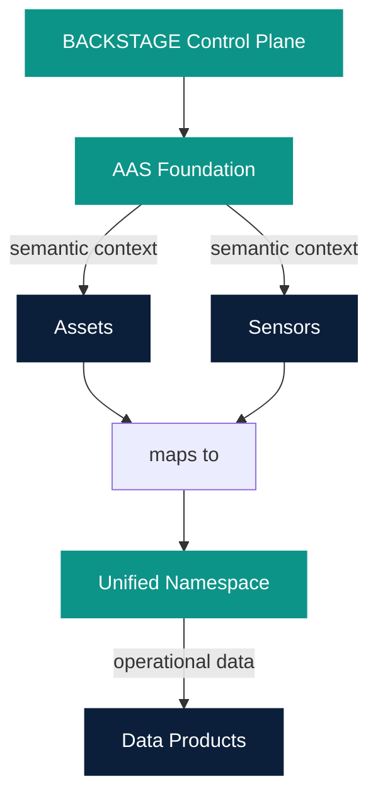

# Asset Administration Shell

Owner: Platform Team  
Last reviewed: 2026-08-21  
Audience: INTERNAL ENGINEERING  
Version: 1.0.0

AAS answers: **what is this asset, sensor, or property and what does it mean?**

UNS answers: **where and how does operational data flow?**

Data Products answer: **what business value is created from those data?**

This is a Platform Component (`component:default/aas-foundation`), not a
Data Product. Certification status is **DEVELOPMENT**. The Control Plane
**Assets** UI is a **PROTOTYPE**: it talks to an in-memory Backstage
adapter, not a production AAS database.

Production target:

```text
Assets UI → AAS backend client → AAS Foundation Service → persistent repository
```

Do not treat the Control Plane as the AAS runtime. The Python AAS
Foundation Service under `platform-components/asset-semantic/aas-foundation/`
is the intended data-plane repository. The two must not remain independent
authoritative stores once the prototype is replaced.

It is not GxP validated and is not a claim of full IDTA / IEC 63278
compliance.



| Concern | System of record |
| --- | --- |
| Platform topology | Backstage Catalog |
| Asset / sensor semantics | AAS Repository |
| Operational namespace / events | Unified Namespace |
| Historical measurements | Time-Series Storage |
| Domain / business value | Data Product |

AAS metadata must not store time-series values. Example: unit `rpm` and
MQTT topic live in AAS; `2026-08-21T10:00:00Z → 4.2` lives in Time-Series
Storage.

See [AAS vs Catalog](vs-catalog.md), [AAS vs UNS](vs-uns.md),
[Administration](administration.md), [Submodels](submodels.md),
[Semantic IDs](semantic-ids.md), [Connectivity mapping](connectivity.md),
[Using AAS from a Data Product](using-from-data-product.md),
[AAS + OEE](oee.md).
