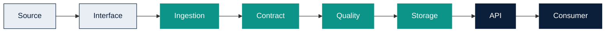

# Data Product Architecture

Owner: Platform Team  
Last reviewed: 2026-08-19  
Audience: INTERNAL ENGINEERING  
Version: MVP 1.1

A Data Product is an independently deployable service. Generated products
vendor the Data Product SDK and expose `/health`, quality, and
`/api/v1/platform-metadata`.

MQTT Temperature ingests MQTT (or a local POST). REST Equipment fetches a
configured REST source (or mock ingest). Neither product writes back to
the system of record in this MVP.

See [Data Product Standard](../engineering/standard.md) and
[data-product-template-standard.md](../data-product-template-standard.md).
Platform Components are composed into Golden Paths; they are not Data
Products. See [Platform Component Library](../platform-components/index.md).
