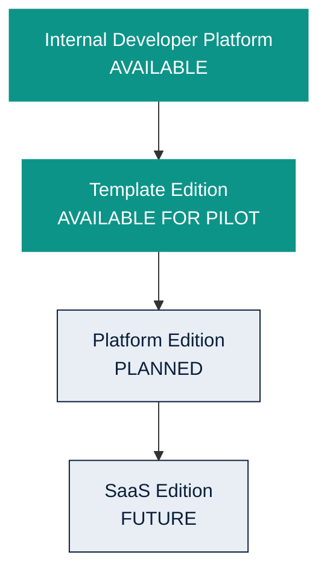

# Deployment Models

Owner: Platform Team  
Last reviewed: 2026-08-19  
Audience: INTERNAL ENGINEERING  
Version: MVP 1.1

Four usage/distribution models. Only Internal Developer Platform is
operated here today. Template Edition Golden Paths are available as MVP.
Platform Edition and SaaS Edition are planned/future.

Canonical commercial text: [deployment-models.md](../deployment-models.md),
[commercial-model.md](../commercial-model.md).

## INTERNAL DEVELOPER PLATFORM — AVAILABLE

Used by our own engineers to build, test, certify and release Golden Paths
and platform capabilities. This running Control Plane.

## TEMPLATE EDITION — AVAILABLE FOR PILOT

Customer consumes selected certified Golden Paths/templates. They operate
their own engineering platform. Designed for future AWS Marketplace
distribution; procurement is not live.

## PLATFORM EDITION — PLANNED

Customer operates its own Nexora instance in its own
environment. Not a GA SKU. Multi-tenancy is not implemented.

## SAAS EDITION — FUTURE

Managed Nexora service with future tenant isolation,
customer identity and entitlements. Not available. Do not treat current
identity as tenant isolation.
