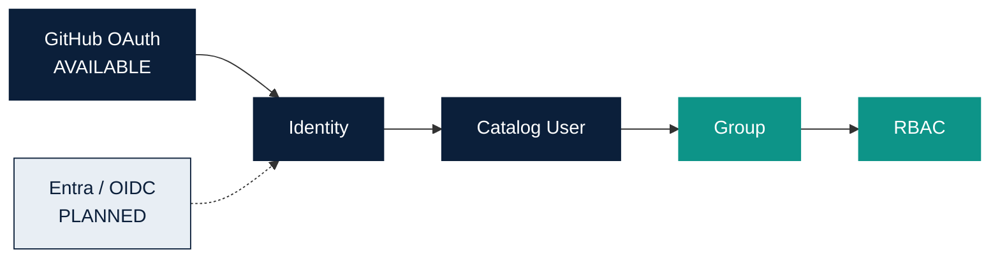

# Identity & RBAC

Owner: Platform Team  
Last reviewed: 2026-08-19  
Audience: INTERNAL ENGINEERING  
Version: MVP 1.1

GitHub user login is separate from GitHub App repository publishing.
Unknown GitHub users are denied. Guest is development-only.

Canonical policy: [identity-and-rbac.md](../identity-and-rbac.md).
Providers: [identity-providers.md](../identity-providers.md).

| Group | Role |
| --- | --- |
| `platform-viewers` | Viewer |
| `data-product-developers` | Developer |
| `data-product-owners` | Data Product Owner |
| `platform-admins` | Platform Admin |

Developer Hub, TechDocs, and Search use the same authenticated portal
session. There is no extra permission for `/developer`. Catalog and
TechDocs read still require an approved Catalog User.
