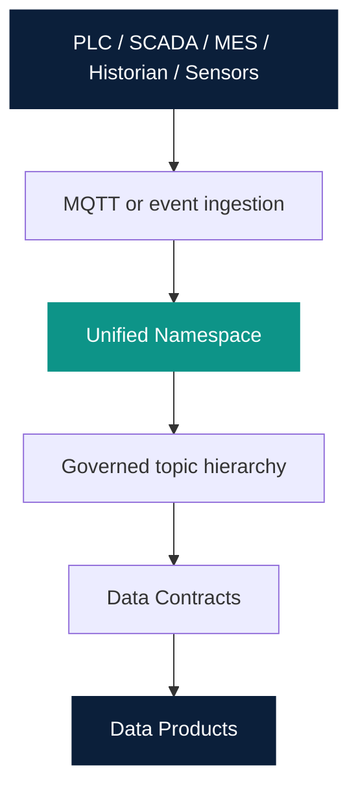

# Integration Architecture

Owner: Platform Team  
Last reviewed: 2026-08-20  
Audience: INTERNAL ENGINEERING  
Version: MVP 1.1

Integration is **governed interface**, not database replication.

| Source class | Typical interface | Platform asset |
| --- | --- | --- |
| Historian / OT telemetry | MQTT | MQTT Temperature Golden Path |
| Equipment / master data API | REST | REST Equipment Golden Path |
| Shared OT/IT event namespace | MQTT Unified Namespace | `platform-component` unified-namespace |
| ERP / MES / LIMS / EWM | API or events (future Golden Paths) | Not a current Golden Path |

Do not implement real SAP or Snowflake connectivity in this milestone.
Do not imply direct database access to MES, ERP, or LIMS.

UNS is Catalog type `platform-component` on system `integration-platform`.
OEE 1.0 does not require UNS; a future OEE product may optionally
`dependsOn: component:default/unified-namespace` (Mode B) or use MQTT
Consumer only (Mode A). See [OEE composition](../oee/composition.md).
UNS is not a Data Product. See [Unified Namespace](../uns/index.md) and
the [Platform Component Library](../platform-components/index.md).

MQTT is the first UNS transport. Kafka is deferred.

Contract identity is `{dataProductName}--{logicalContractName}`. Provider
and consumer bind through the contract, not through source internals. See
[api-identity.md](../api-identity.md) and
[Contracts](../engineering/contracts.md).
