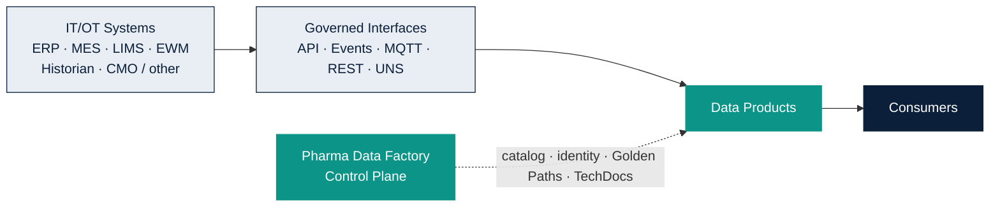
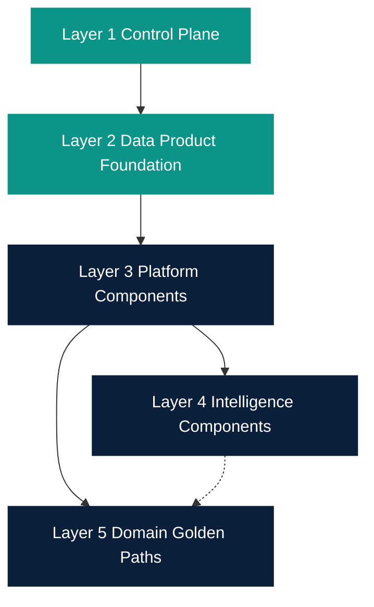
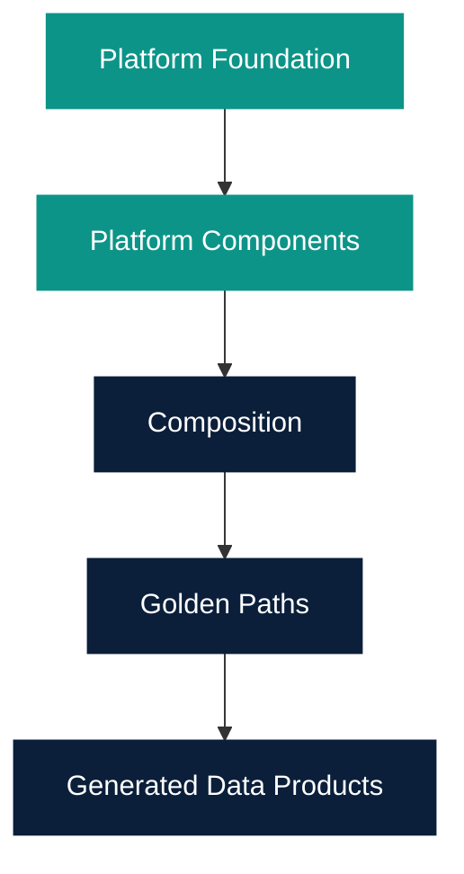
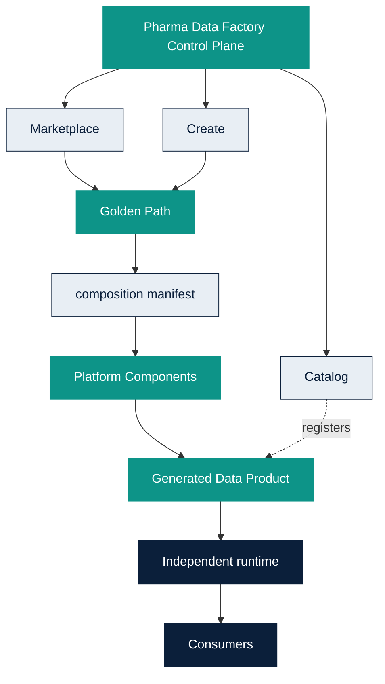
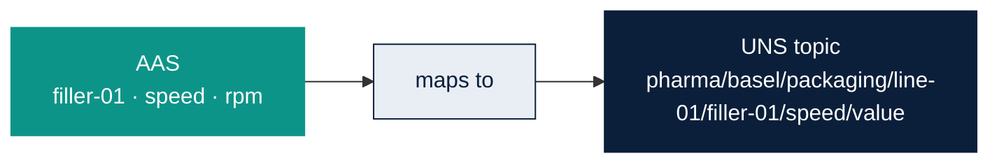
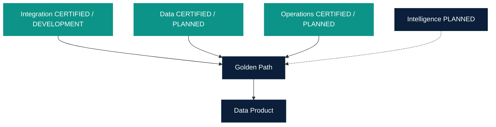
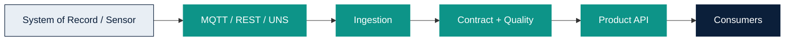
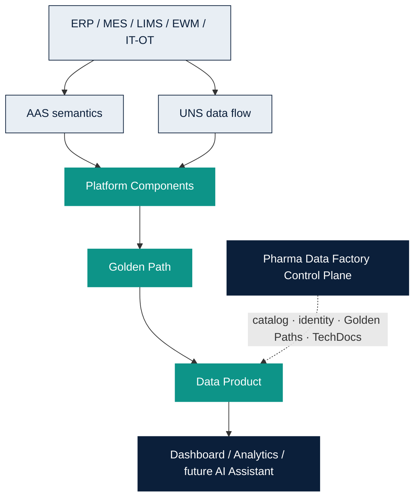
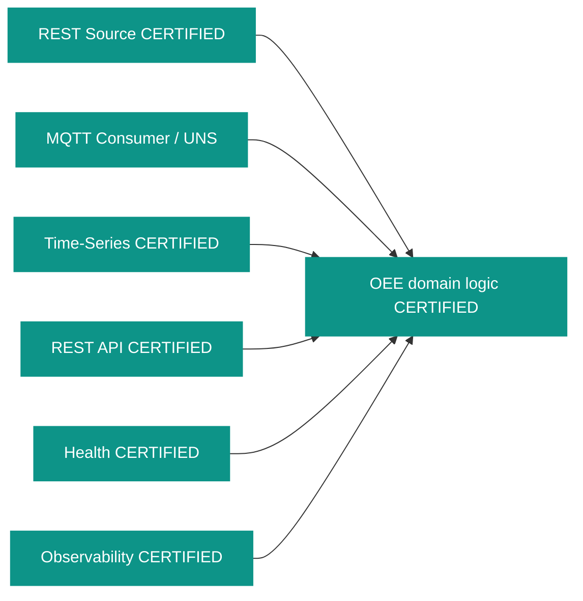
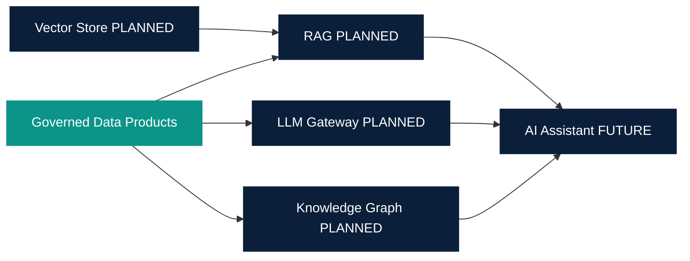

# Platform Architecture

Owner: Platform Team  
Last reviewed: 2026-08-19  
Audience: INTERNAL ENGINEERING  
Version: MVP 1.1

Pharma Data Factory is the engineering and governance Control Plane.
IT/OT systems stay systems of record. Data Products sit on governed
interfaces. Consumers bind to contracts, not to source internals.

Canonical engineering notes: [architecture.md](../architecture.md).

## Control Plane capabilities

Marketplace, Create, Catalog, Data Products, TechDocs, Search, identity,
RBAC, GitHub App publishing, CI Quality Gate display, Platform Compliance.

The Control Plane does not store all enterprise data and does not replace
source systems. Unified Namespace is a reusable platform component for
governed MQTT topics. It is not a business Data Product. Asset
Administration Shell Foundation is a reusable platform component for
asset and sensor semantics. AAS is not UNS and is not a historian.

## Five architecture layers

1. **Control Plane** — Backstage, Catalog, Create, Marketplace, Developer Hub, TechDocs, Search, identity, RBAC, governance.
2. **Data Product Foundation** — Standard, SDK, contracts, quality, compatibility, CI/CD, versioning, platform compliance.
3. **Platform Components** — reusable integration, data, and operations building blocks. Catalog `spec.type: platform-component`.
4. **Intelligence Components** — planned RAG / LLM / Knowledge Graph placeholders. Not implemented.
5. **Domain Golden Paths** — MQTT Temperature, REST Equipment, and OEE now (technically CERTIFIED / RELEASED). Cold Chain, Quality, Energy, AI Assistants later.

Registry: `/platform-components`. See
[Platform Component Library](../platform-components/index.md).

## Developer lifecycle

The technical HOW for developers is also on
`/platform/architecture/developer`. That page links here instead of
creating a second documentation system.

## AAS versus Unified Namespace

AAS answers what an asset is and what its data means. Unified Namespace
answers where and how operational data flows. Neither replaces ERP, MES,
LIMS or EWM.

## Platform Component composition

Wave 1 Health, Observability, REST API, REST Source, MQTT Consumer and
Time-Series Storage are technically CERTIFIED. Unified Namespace and AAS
Foundation are DEVELOPMENT. Intelligence components are PLANNED.

## Golden Path lifecycle

Official examples: MQTT Temperature, REST Equipment, and OEE
(technically CERTIFIED / RELEASED). Cold Chain, Quality, Energy and AI
Assistant remain future. OEE commercial availability is FUTURE.

## Data Product runtime

The generated runtime does not require the Control Plane to keep serving
consumers.

## System of Record to consumer

Direct database access is not the standard integration method.

## OEE composition

OEE Golden Path 1.0 is technically CERTIFIED. It is not GxP validation.
The generated OEE runtime is independent of the Control Plane.

## Future Intelligence composition

RAG, LLM Gateway, Knowledge Graph and Vector Store are planned. They are
not available.

