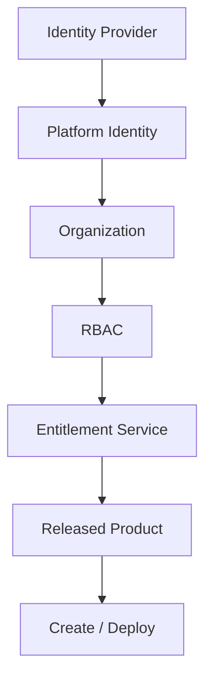

# Commercial architecture

Owner: Platform Team  
Documentation Version: 1.0  
Applicable Platform: Data Product Standard 1.0.x  
Last Reviewed: 2026-08  
Audience: INTERNAL ENGINEERING

Pharma Data Factory can be procured later through AWS Marketplace. That
channel is **not** the in-product Marketplace, and it is **not** the
RBAC model.

This Control Plane is designed for future AWS Marketplace distribution.
There is **no live AWS Marketplace listing** in this release.



## Layers that must stay separate

| Concern | Question | Current implementation |
| --- | --- | --- |
| Identity | Who is the user? | GitHub OAuth / Guest fallback |
| RBAC | What may the user do? | Catalog groups + Permission Framework |
| Organization | Which company? | Single `internal` organization. Not multi-tenancy. |
| Entitlement | Which commercial capabilities? | Entitlement service + provider adapters |
| Release | Which artifact may be consumed? | RELEASED Golden Path / platform release |

AWS Marketplace is one possible **entitlement source**. It must not
authorize privileged behavior by itself.

## Editions

| Edition | Status | Entitlement |
| --- | --- | --- |
| Internal Developer Platform | AVAILABLE | Local configuration / all approved engineering capabilities |
| Template Edition | AVAILABLE FOR PILOT | `golden-path.mqtt-temperature`, `golden-path.rest-equipment` |
| Platform Edition | PLANNED | `platform.core` plus contracted Golden Paths / Components |
| SaaS Edition | FUTURE | Future Marketplace agreement or direct contract |

Do not present Platform Edition or SaaS as generally available.

## Providers

```text
Marketplace UI
     ↓
Entitlement Service
     ↓
Entitlement Provider
     ├── Local
     └── AWS Marketplace
```

Local is the default. AWS is an adapter. Core Marketplace, Scaffolder,
and Catalog code do not call AWS APIs.

Related: [Entitlements vs RBAC](entitlements-vs-rbac.md),
[AWS Marketplace integration](aws-marketplace-integration.md),
[AWS Marketplace test listing](aws-marketplace-test-listing.md),
[Product IDs](commercial-product-ids.md).
