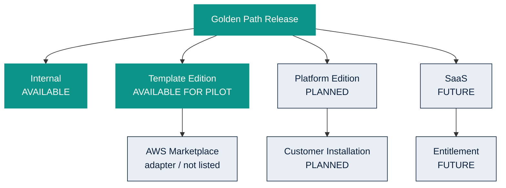

# Distribution channels

Owner: Platform Team  
Documentation Version: 1.0  
Applicable Platform: Data Product Standard 1.0.x  
Last Reviewed: 2026-08  
Audience: INTERNAL ENGINEERING

Distribution metadata describes where a Golden Path release is approved
to be distributed. It is not an entitlement, license, or billing system.

| Channel | Status | Meaning |
| --- | --- | --- |
| INTERNAL | AVAILABLE | Used by Pharma Data Factory engineers |
| TEMPLATE_EDITION | AVAILABLE FOR PILOT | Approved certified templates for a controlled Template Edition pilot. Not commercially distributable while legal gates are OPEN |
| PLATFORM_EDITION | PLANNED | Future customer-hosted Control Plane. Not available. |
| SAAS | FUTURE | Future managed service entitlements. Not available. |

Do not present Platform Edition or SaaS as available. Commercial
entitlement is enforced separately from technical release status.
AWS Marketplace does not deliver a template ZIP.

Related: [deployment models](../architecture/deployment-models.md),
[Template Edition](../template-edition.md).
