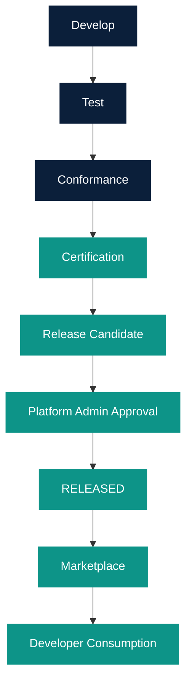

# Release management

Owner: Platform Team  
Documentation Version: 1.0  
Applicable Platform: Data Product Standard 1.0.x  
Last Reviewed: 2026-08  
Audience: INTERNAL ENGINEERING

Golden Path releases are version-controlled YAML/JSON. There is no
release database and no commercial entitlement in this milestone.

Canonical manifest: `catalog/releases/golden-path-releases.yaml`  
Runtime copy: `packages/platform-common/src/golden-path-releases.json`

Every official release records:

- template
- templateVersion (SemVer)
- releaseStatus / lifecycle
- releaseDate
- dataProductStandardVersion
- dataProductSdkVersion
- certificationStatus
- releaseNotes

SemVer is the existing policy in [versioning-policy.md](../versioning-policy.md).
Do not invent a second versioning scheme.

## Governance

| Role | Release action |
| --- | --- |
| Developer | Develop, test, propose TESTING |
| Data Product Owner | Review certification information |
| Platform Admin | Approve RELEASED, deprecate, retire |

Backend permission `golden-path.release.manage` is Admin-only. Frontend
hiding is not sufficient.

Authenticated catalog: `/releases`.
