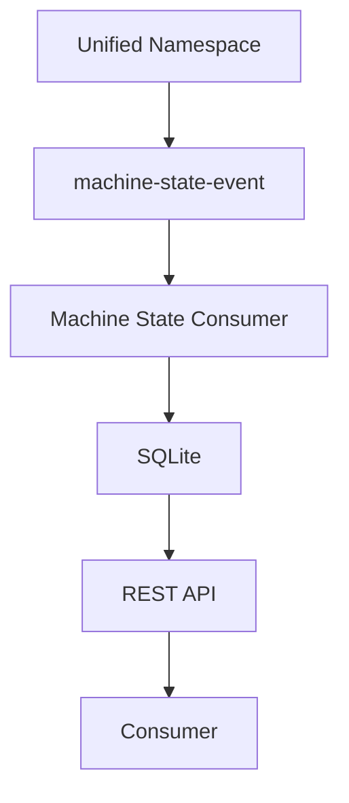

# Compose a Data Product with Unified Namespace

Owner: Platform Team  
Last reviewed: 2026-08-20  
Audience: PLATFORM USER  
Version: 1.0.0

This is the composition proof for Unified Namespace. It does not
calculate OEE. REST API and Observability Platform Components are
future composition candidates; they are Catalog placeholders, not
composed here.

1. Select or create Unified Namespace (`component:default/unified-namespace`).
2. Identify Topic Contract `machine-state-event` `1.0.0`.
3. Declare composition in `catalog/compositions/machine-state-consumer.yaml`.
4. Validate composition (Catalog type `platform-component`, version `1.x`).
5. Generate the Machine State Consumer from Create.
6. Run locally with `MQTT_HOST` empty.
7. Publish the sample event to `POST /api/v1/events`.
8. Verify `GET /api/v1/machines/filler-01` returns `RUNNING`.
9. Inspect Catalog Graph: UNS → Machine State Consumer.
10. Inspect Quality, Contract, and TechDocs.

See [Using Components](../platform-components/using.md) and
[UNS Overview](../uns/index.md).
