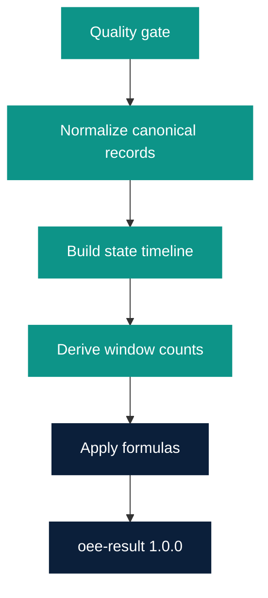

# OEE Calculation 1.0

Owner: Platform Team  
Last reviewed: 2026-08-21  
Audience: INTERNAL ENGINEERING  
Version: 1.0.0

Calculation semantics for the OEE Data Product Golden Path
(`templates/oee-data-product`). **Do not change these formulas.** Numeric
scenarios below are the acceptance tests.

## Pipeline



1. Reject invalid events ([Quality rules](#quality-rules)).
2. Deduplicate by `eventId` (first accepted wins).
3. Sort remaining events by event timestamp, then `eventId`.
4. Clip state intervals and count deltas to `[windowStart, windowEnd)`.
5. Apply [domain formulas](domain-model.md#formulas).
6. Round published ratios to 4 decimal places, round half up, only on
   the output contract. Intermediate math uses full precision.

## State timeline

For each equipment:

- Walk state events in event-time order.
- The state after an event holds until the next event timestamp.
- Clip intervals to the window.
- Time before the first state in/before the window is **unobserved**.
- A state that started before `windowStart` continues into the window.
- Missing final event: the last known state holds until `windowEnd`
  (exclusive). Do not invent a closing state.
- Duplicate identical state: zero-length interval, ignored for durations.
- Same timestamp: greater `eventId` wins ([Edge cases](edge-cases.md)).

Runtime and downtime use only intervals that overlap planned production.

## Count deltas

Cumulative algorithm (production `totalCount`; same idea per quality
field):

```text
produced = 0
previous = none
for reading in event-time order (clipped to window, including last
baseline at or before windowStart when present):
  if previous is none:
    previous = reading
    continue
  if reading >= previous:
    produced += reading - previous
  else:
    produced += reading   # reset: treat reading as post-reset total
  previous = reading
```

The opening baseline is not production.

## Quality rules

These are OEE-specific checks in addition to generic Data Product
quality. Failed events are not stored and not calculated.

| Check | Fail when |
| --- | --- |
| Valid machine state | `state` missing or not in `RUNNING`, `STOPPED`, `IDLE`, `MAINTENANCE` |
| Valid counts | Non-integer, negative, or non-finite |
| `goodCount <= totalCount` | Window-level: quality-derived `goodCount` exceeds production `totalCount` → `COUNT_MISMATCH`, do not rewrite counts |
| `rejectCount >= 0` | `rejectCount < 0` |
| `idealCycleTime > 0` | Context `idealCycleTimeSeconds <= 0` or missing when Performance is requested |
| No overlapping active states | After normalization there is at most one state per timestamp; producer overlap is folded, not failed, unless two events share timestamp **and** different `state` with no deterministic `eventId` order — then fail both |
| Timestamps valid | Missing, not timezone-aware ISO-8601, or `windowStart >= windowEnd` |
| Required context present | No production context covering the equipment for Performance / order windows |
| Duplicate events | Same `eventId` after the first: ignore (not a fail) |

`goodCount <= totalCount` on the **result** is also a window-level
quality check. If quality-derived good count exceeds production
`totalCount`, set `reconciliationStatus: COUNT_MISMATCH` and still
publish; do not invent counts.

## Deterministic test scenarios

Shared fixture unless a scenario overrides it:

- Equipment `filler-01`
- Window `[2026-08-21T08:00:00Z, 2026-08-21T09:00:00Z)` → 3600 s
- No planned downtime, fully observed
- `idealCycleTimeSeconds = 1.0`
- `windowKind = custom`
- `calculationStatus = COMPLETE` unless a scenario overrides it
- `completeness = COMPLETE` unless a scenario overrides it

Ratios below are the published 4-decimal values.

### 1. Perfect OEE = 1.0

| Input | Value |
| --- | --- |
| State | `RUNNING` for the full window |
| Counts | `totalCount` 3600, `goodCount` 3600, `rejectCount` 0 |

| Output | Value |
| --- | --- |
| `runtimeSeconds` | 3600 |
| `downtimeSeconds` | 0 |
| `plannedProductionSeconds` | 3600 |
| `availability` | 1.0000 |
| `performance` | 1.0000 |
| `quality` | 1.0000 |
| `oee` | 1.0000 |

### 2. Downtime lowers Availability

| Input | Value |
| --- | --- |
| State | `RUNNING` 08:00–08:55, `STOPPED` 08:55–09:00 |
| Counts | 3300 good, 0 reject (ideal rate while running) |

| Output | Value |
| --- | --- |
| `runtimeSeconds` | 3300 |
| `downtimeSeconds` | 300 |
| `availability` | 0.9167 |
| `performance` | 1.0000 |
| `quality` | 1.0000 |
| `oee` | 0.9167 |

`3300 / 3600 = 0.9166…` → `0.9167`.

### 3. Slower cycle lowers Performance

| Input | Value |
| --- | --- |
| State | `RUNNING` full window |
| Counts | `totalCount` 1800, all good |

| Output | Value |
| --- | --- |
| `availability` | 1.0000 |
| `performance` | 0.5000 |
| `quality` | 1.0000 |
| `oee` | 0.5000 |

### 4. Rejects lower Quality

| Input | Value |
| --- | --- |
| State | `RUNNING` full window |
| Counts | `totalCount` 3600, `goodCount` 3240, `rejectCount` 360 |

| Output | Value |
| --- | --- |
| `availability` | 1.0000 |
| `performance` | 1.0000 |
| `quality` | 0.9000 |
| `oee` | 0.9000 |

### 5. Zero production

| Input | Value |
| --- | --- |
| State | `RUNNING` full window |
| Counts | `totalCount` 0 |

| Output | Value |
| --- | --- |
| `availability` | 1.0000 |
| `performance` | 0.0000 |
| `quality` | `null` |
| `oee` | `null` |
| `completeness` | `COMPLETE` |
| `calculationStatus` | `MISSING_QUALITY_DATA` |

### 6. Late event

Same as scenario 2, except the `STOPPED` event (`timestamp` 08:55:00Z)
arrives after `windowEnd` processing time.

| Output | Value |
| --- | --- |
| Same as scenario 2 | Event time is inside the window, so it is included |

Arrival time is not used for membership. See
[Time windows](time-windows.md#event-time-vs-processing-time).

### 7. Duplicate event

Scenario 1 plus a second copy of the 3600-count event with the **same**
`eventId`.

| Output | Value |
| --- | --- |
| Same as scenario 1 | Duplicate ignored |

A second event with a new `eventId` and the same cumulative reading
adds zero production (delta 0).

### 8. Count reset

Readings (cumulative `totalCount`):

| Timestamp | totalCount |
| --- | --- |
| 08:00:00Z | 9000 |
| 08:10:00Z | 9100 |
| 08:20:00Z | 50 |
| 09:00:00Z exclusive — last in window 08:59:59Z | 150 |

State `RUNNING` full window. All units good.
`idealCycleTimeSeconds = 1.0`.

Produced: `(9100 − 9000) + 50 + (150 − 50) = 250`.

| Output | Value |
| --- | --- |
| `totalCount` | 250 |
| `availability` | 1.0000 |
| `performance` | 0.0694 |
| `quality` | 1.0000 |
| `oee` | 0.0694 |

`250 / 3600 = 0.06944…` → `0.0694`.

### 9. Missing ideal cycle time

Scenario 1 inputs without `idealCycleTimeSeconds` on context.

| Output | Value |
| --- | --- |
| `availability` | 1.0000 |
| `performance` | `null` |
| `quality` | 1.0000 |
| `oee` | `null` |
| `completeness` | `INCOMPLETE` |
| `calculationStatus` | `MISSING_IDEAL_CYCLE` |

### 10. Mixed loss (Scenario E)

| Input | Value |
| --- | --- |
| State | `RUNNING` 08:00–08:55, `STOPPED` 08:55–09:00 |
| Counts | `totalCount` 1650, `goodCount` 1485, `rejectCount` 165 |

| Output | Value |
| --- | --- |
| `runtimeSeconds` | 3300 |
| `downtimeSeconds` | 300 |
| `availability` | 0.9167 |
| `performance` | 0.5000 |
| `quality` | 0.9000 |
| `oee` | 0.4125 |
| `calculationStatus` | `COMPLETE` |

`0.9167 × 0.5 × 0.9 = 0.412515` → `0.4125`.

### 11. 100% reject

| Input | Value |
| --- | --- |
| State | `RUNNING` full window |
| Counts | `totalCount` 3600, `goodCount` 0, `rejectCount` 3600 |

| Output | Value |
| --- | --- |
| `availability` | 1.0000 |
| `performance` | 1.0000 |
| `quality` | 0.0000 |
| `oee` | 0.0000 |
| `calculationStatus` | `COMPLETE` |

This is **not** “cannot calculate”.

### 12. REST source unavailable

No cached `production-context`. States and counts as scenario 1.

| Output | Value |
| --- | --- |
| `availability` | 1.0000 |
| `performance` | `null` |
| `oee` | `null` |
| `calculationStatus` | `MISSING_PRODUCTION_CONTEXT` |
| Health | REST Source check DOWN |
| API | 200 with nullable OEE, not 0 |

### 13. MQTT unavailable

Broker down after scenario 1 was stored.

| Output | Value |
| --- | --- |
| Last stored result | Unchanged |
| Health | MQTT Consumer DOWN |
| Current open window | Recalculate from stored events; missing inputs use explicit `MISSING_*` / `INSUFFICIENT_OBSERVATION`. Open windows are not a separate status. |

### 14. Storage unavailable

| Output | Value |
| --- | --- |
| API | **503** |
| Body | No `oee: 0` |
| Health | Readiness DOWN |
