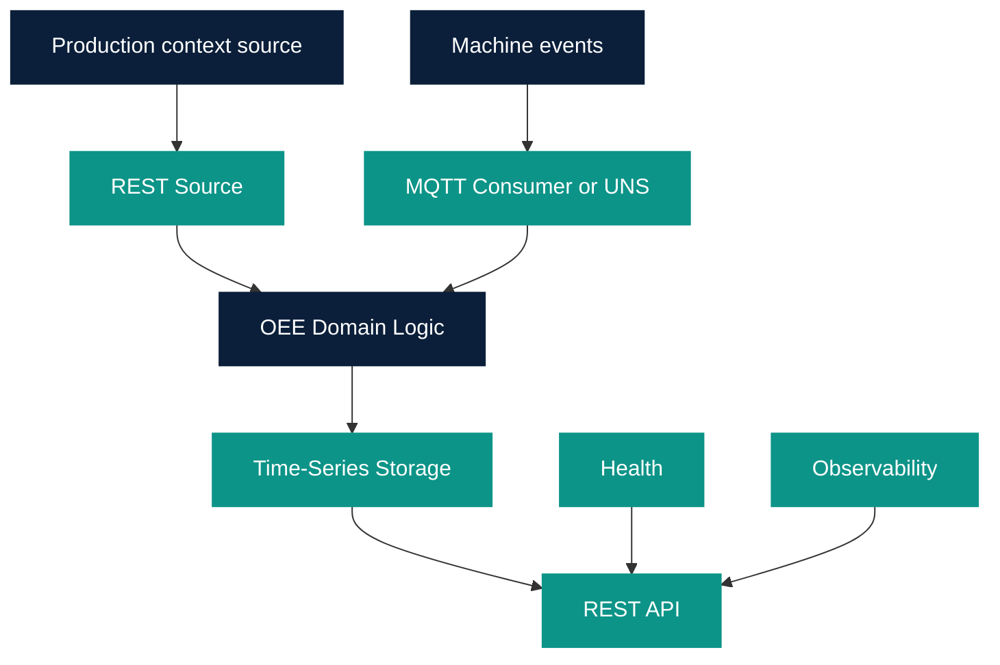

# OEE Composition 1.0

Owner: Platform Team  
Last reviewed: 2026-08-21  
Audience: INTERNAL ENGINEERING  
Version: 1.0.0

Target Platform Component composition for the OEE Golden Path 1.0.
**Do not implement OEE domain logic in Platform Components.** Formulas
stay in `templates/oee-data-product`.

Existing Golden Paths are not refactored. Wave 1 components stay
generic: they must not contain OEE formulas.

## UNS position

OEE 1.0 **must not require** Unified Namespace.

| Mode | Machine states and counts | Production context |
| --- | --- | --- |
| A Direct MQTT Consumer | MQTT Consumer | REST Source |
| B Unified Namespace | UNS (MQTT transport) | REST Source |

Mode B is available **after** UNS is technically CERTIFIED.
Until then Mode A is the OEE MVP. Kafka is not an OEE 1.0 input.



OEE Domain Logic is Data Product code, not a Platform Component.

## Component roles

| Component | Certification today | OEE 1.0 role |
| --- | --- | --- |
| REST Source | CERTIFIED 1.0.0 | GET `production-context` |
| MQTT Consumer | CERTIFIED 1.0.0 | Mode A: state and count topics |
| Unified Namespace | DEVELOPMENT | Mode B only; optional `dependsOn` |
| Time-Series Storage | CERTIFIED 1.0.0 | Persist A/P/Q/OEE points and supporting durations/counts |
| REST API | CERTIFIED 1.0.0 | Expose `oee-result` |
| Health | CERTIFIED 1.0.0 | Liveness / readiness |
| Observability | CERTIFIED 1.0.0 | Logs, metrics, correlation id |
| AAS Foundation | DEVELOPMENT 1.0.0 | Resolve equipment, sensors, units, machine-state meaning, endpoint mappings |

Do not put Availability math in MQTT Consumer or Time-Series Storage.
Do not store OEE results in AAS. AAS is asset master/semantics only.

Time-Series metric names (plan, not schema lock-in):
`oee.availability`, `oee.performance`, `oee.quality`, `oee.oee`,
`oee.runtime_seconds`, `oee.downtime_seconds`, `oee.total_count`,
`oee.good_count`. Entity id = `equipmentId`. Tags may include
`windowKind`, `orderId`.

## Catalog relationships

Planned native relations for a generated product `{product}`:

```yaml
spec:
  type: data-product
  dependsOn:
    - component:default/rest-source
    - component:default/mqtt-consumer
    - component:default/timeseries
    - component:default/rest-api
    - component:default/health
    - component:default/observability
    # optional:
    # - component:default/unified-namespace
  providesApis:
    - {product}--oee-result
  consumesApis:
    - {product}--machine-state-event
    # or unified-namespace--machine-state-event in Mode B
    - {product}--production-count-event
    - {product}--quality-count-event
    - {product}--production-context
```

Used By is derived. Do not store inverse annotations.

Placeholder `example-oee-data-product` currently `dependsOn` Unified
Namespace so Catalog Graph can show Mode B. That is an architectural
example, not a requirement for every future OEE instance.

Manifests:

- Mode B example: `catalog/artifacts/nexora/oee-data-product-uns.yaml`
- Mode A **Golden Path 1.0 baseline**: `catalog/artifacts/nexora/oee-data-product-direct.yaml`

`kind: GoldenPathComposition` is not a Backstage Catalog kind.

This composition is **finalized for design**. Validation is a library
check, not runtime orchestration.

## What not to compose

- Kafka Consumer / Producer (no Kafka infrastructure)
- RAG, LLM, Knowledge Graph
- Billing, multi-tenancy, SaaS entitlements
- Real SAP or MES connectors (REST Source stays generic GET)

## Implementation boundary

This design is done when the documents and schemas are published.
The next workstream (not started automatically) is an OEE Golden Path
that generates a Python Data Product implementing these contracts.
