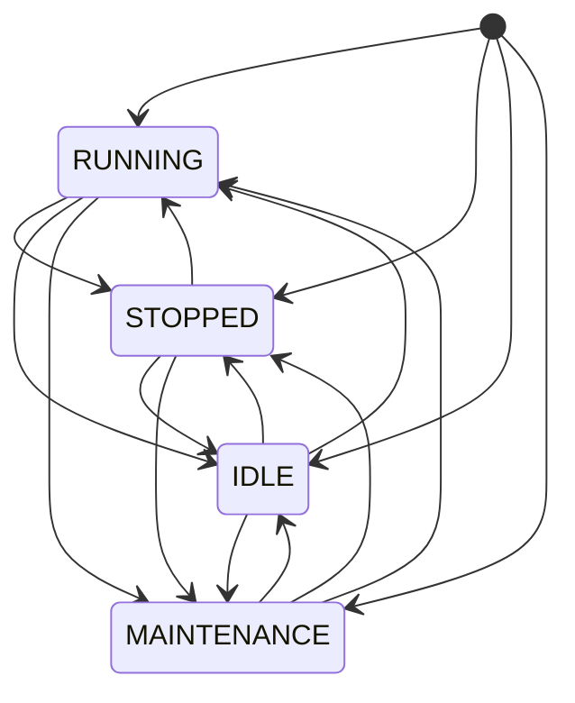

# OEE Domain Model 1.0

Owner: Platform Team  
Last reviewed: 2026-08-21  
Audience: INTERNAL ENGINEERING  
Version: 1.0.0

Canonical manufacturing OEE for Pharma Data Factory. This document
defines meaning, units, and formulas. It does not implement calculation.

OEE 1.0 follows the classic Availability × Performance × Quality model
used in ISO 22400-style OEE. Site calendars, SAP order types, and MES
reason codes are out of scope.

## Scope

OEE is calculated **per equipment** for an explicit time window.
One result row is one `(equipmentId, windowStart, windowEnd)` tuple.
A production order is a window kind, not a second grain mixed into the
same row.

CERTIFIED on this design means technical contract completeness only.
It is not GxP validation.

## Canonical concepts

### Equipment

The physical or logical asset for which OEE is reported.

| Field | Meaning |
| --- | --- |
| `equipmentId` | Stable equipment identity used on every input and the result |
| `site`, `area`, `line` | Location context from production context; not a second identity |

OEE 1.0 does not roll up line or site OEE. Aggregation is a later product
decision.

### Production order / context

The planned production assignment for equipment. It supplies the
parameters that machine events cannot: ideal cycle time, target quantity,
and planned interval. Field names are domain names, not SAP/MES names.

See [Contracts](contracts.md#production-context-100).

### Planned Production Time

Duration inside the calculation window that is **intended for production**.

```text
plannedProductionSeconds
  = windowSeconds
  − plannedDowntimeSeconds
  − unobservedSeconds
```

`windowSeconds` is the length of `[windowStart, windowEnd)`.
Planned downtime is declared on production context (maintenance windows
or other planned-down intervals). Unobserved time is excluded so missing
telemetry does not become invented downtime.

### Running Time

Duration of state `RUNNING` that overlaps planned production time.
Canonical result field: `runtimeSeconds`.

### Stop Time / Unscheduled Downtime

Duration of unplanned non-running time that overlaps planned production
time. Canonical result field: `downtimeSeconds`.

OEE 1.0 unscheduled downtime states: `STOPPED` and `IDLE`.

### Scheduled Downtime

Union of:

1. `plannedDowntime[]` on production context
2. State `MAINTENANCE`

Excluded from `plannedProductionSeconds`. Not included in
`downtimeSeconds`. Do not double-subtract overlapping intervals.

### Ideal Cycle Time

Theoretical fastest time to produce one countable unit while running.
Unit: **seconds per unit**. Must be `> 0` to compute Performance.

Source: production context for the window. If several context records
overlap the window, see [Edge cases](edge-cases.md#missing-or-conflicting-ideal-cycle-time).

### Actual Cycle Time

Diagnostic only. Not an OEE 1.0 formula input.

```text
actualCycleTimeSeconds = runtimeSeconds / totalCount   # when totalCount > 0
```

Otherwise `null`. Performance already encodes the inverse relationship
(`idealCycleTimeSeconds × totalCount / runtimeSeconds`).

### Total Count

Units produced in the window, good and reject together. Derived from
cumulative `production-count-event` readings (and quality events when
that is the only count source). Integer `>= 0`.

### Good Count

Units accepted in the window. Integer `>= 0`.

### Reject Count

Units rejected in the window. Integer `>= 0`.

Reconciliation: [Contracts](contracts.md#quality-reconciliation).

## Machine state contribution

Reuse existing `machine-state-event` 1.0.0 states. Do not introduce
site-specific reason maps in OEE 1.0.

| State | In planned production? | Runtime | Downtime |
| --- | --- | --- | --- |
| `RUNNING` | Yes | Yes | No |
| `STOPPED` | Yes | No | Yes (unplanned) |
| `IDLE` | Yes | No | Yes (unplanned availability loss) |
| `MAINTENANCE` | No (planned downtime) | No | No (excluded from the Availability denominator) |
| *(unobserved)* | No | No | No |

`reason` on `machine-state-event` is diagnostic only. It does not change
A / P / Q in 1.0.

This mapping is the platform default. A later minor version may add
optional context flags (for example treat specific idle as planned) as
**COMPATIBLE** optional fields. Do not hard-code a customer site model.



A machine has exactly one active state at any event time. A new state
event ends the previous state at the new event timestamp.

## Formulas

All ratios are dimensionless. Times are seconds. Counts are units.

```text
Availability = runtimeSeconds / plannedProductionSeconds

Performance  = (idealCycleTimeSeconds × totalCount) / runtimeSeconds

Quality      = goodCount / totalCount

OEE          = Availability × Performance × Quality
```

Guards:

| Condition | Availability | Performance | Quality | OEE |
| --- | --- | --- | --- | --- |
| `plannedProductionSeconds = 0` | `null` | still computed if runtime exists | still computed | `null` |
| `runtimeSeconds = 0` and `totalCount = 0` | computed | `null` | `null` | `0` if Availability is 0; otherwise `null` |
| `runtimeSeconds = 0` and `totalCount > 0` | computed | `null` (no run time to evaluate speed) | computed | `null` |
| `runtimeSeconds > 0` and `totalCount = 0` | computed | `0` | `null` | `0` |
| `totalCount = 0` otherwise | computed | computed | `null` | `0` if Performance is 0; else `null` |
| `idealCycleTime` missing or `<= 0` | computed | `null` | computed | `null` |
| Any required factor is `null` | — | — | — | `null` |

Do **not** silently clamp Availability, Quality, or Performance.
Availability and Quality outside `[0, 1]` after valid inputs indicate a
bug (fail the calculation as `INVALID_INPUT`). Performance **may exceed
1.0**. Invalid source data is rejected by quality checks, not rewritten.

Published ratios: 4 decimal places, round half up, on the output
contract only. Intermediate math uses full precision.

See [calculationStatus](quality.md#calculationstatus).

## Units

| Quantity | Unit | Notes |
| --- | --- | --- |
| Timestamps | ISO-8601 with timezone | Compare in UTC |
| Durations | seconds | Non-negative number; tests use integers |
| Ideal cycle time | seconds / unit | `> 0` |
| Counts | unit | Integer `>= 0` |
| A, P, Q, OEE | ratio | Tests compare 4 decimal places, round half up |
| `targetQuantity` | unit | Context only; not used in 1.0 formulas |

## Assumptions

1. Event time, not processing time, decides window membership and state
   intervals. See [Time windows](time-windows.md).
2. Counts are **cumulative** per equipment. See [Contracts](contracts.md#count-convention).
3. One active state per equipment; overlapping reports are normalized.
4. Production context is the source of ideal cycle time. Machine events
   do not carry it.
5. OEE 1.0 is not a line-balance, SMED, or Six Big Losses model.
6. No SAP, MES, Kafka, or UNS runtime is required to *define* these
   concepts. Runtime composition is [Composition](composition.md).
