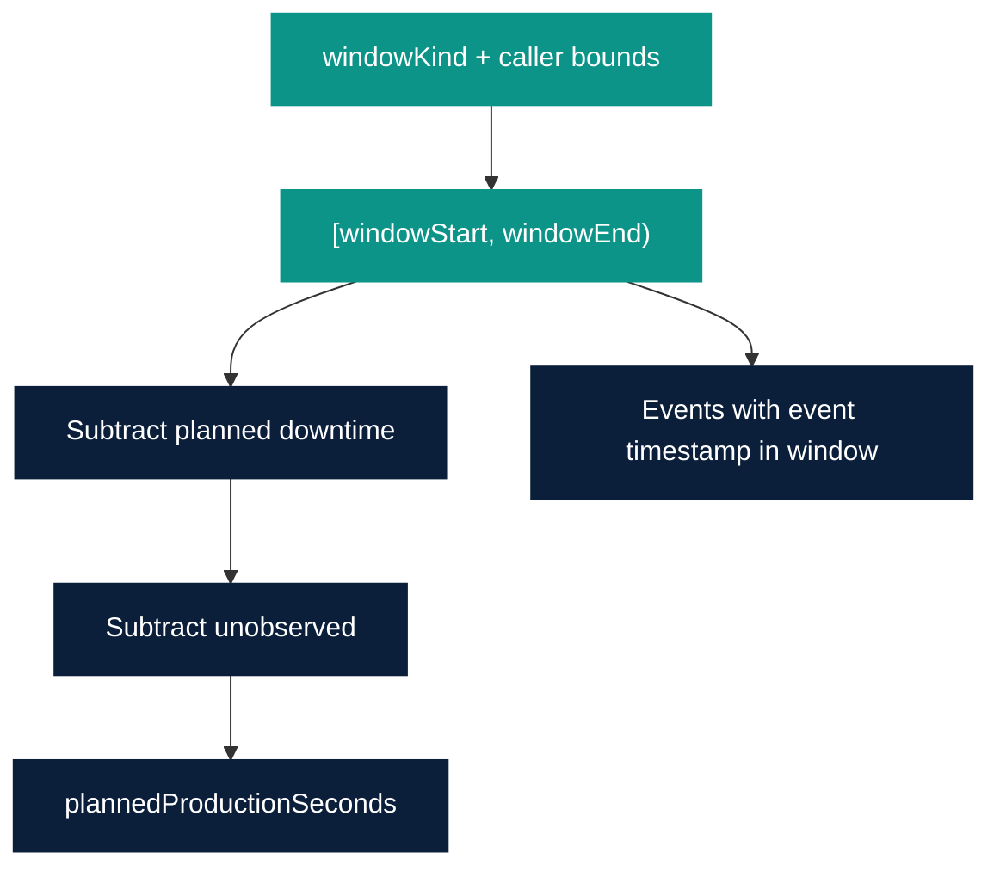

# OEE Time Windows 1.0

Owner: Platform Team  
Last reviewed: 2026-08-21  
Audience: INTERNAL ENGINEERING  
Version: 1.0.0

How OEE 1.0 binds events to a calculation interval. Runtime is not
implemented.

## Interval

Every calculation uses a half-open interval:

```text
[windowStart, windowEnd)
```

`windowEnd` is exclusive. An event at exactly `windowEnd` belongs to the
next window. `windowStart` must be strictly before `windowEnd`.
Both are timezone-aware ISO-8601; comparison is in UTC.

## Window kinds

OEE 1.0 does not ship a site shift calendar. The caller (API, job, or
future Golden Path) supplies `windowStart` and `windowEnd`. `windowKind`
is a label for how those instants were chosen.

| Kind | How the range is chosen | Notes |
| --- | --- | --- |
| `hour` | Clock hour in UTC unless context supplies an offset | Example: `[08:00:00Z, 09:00:00Z)` |
| `day` | UTC date unless context supplies a site offset | Example: `[00:00:00Z, 24:00:00Z)` next midnight |
| `shift` | Caller-supplied shift interval | No default 06:00–14:00 guess |
| `order` | Intersection of `[plannedStart, plannedEnd)` from matching production context with any additional filter range | If several orders overlap, one result per `orderId` |
| `custom` | Explicit range | Default for tests |

Site-local hour/day is a remaining business decision. 1.0 publishes UTC
windows unless context later adds an optional timezone field
(`COMPATIBLE`).



## Event-time vs processing-time

| Clock | Used for |
| --- | --- |
| Event time (`timestamp` on the event) | Window membership, state interval ends, count order, late-event inclusion |
| Processing time (`calculatedAt` / ingest time) | Observability only |

OEE math never uses processing time to decide whether a point belongs
in the window.

## Out-of-order events

Events may arrive in any order.

1. Buffer or store by `eventId`.
2. Sort by event time, then `eventId`, before calculation.
3. Rebuild the state timeline from the sorted list (replay).
4. A later-arriving event with an **earlier** event time is not dropped
   for being late; it is inserted in event-time order.
5. For **current** live windows, the result is “as of `calculatedAt`”
   using every accepted event received so far.

OEE 1.0 is a **replay** model, not a streaming watermark model. A future
implementation may add an optional grace period before publishing a
closed hour/shift. That would be a `COMPATIBLE` operational setting, not
a contract change, if `oee-result` shape stays the same.

## Late events

A late event is one whose processing time is after `windowEnd` but whose
event time is inside the window.

| Behavior | 1.0 rule |
| --- | --- |
| Membership | Include (event time) |
| Closed window already published | Recalculate and supersede the result for the same `(equipmentId, windowStart, windowEnd, orderId)` |
| Event time after `windowEnd` | Not in this window |

There is no implicit “too late to count” cutoff in the contract.

## Open vs closed windows

| Window | Semantics |
| --- | --- |
| Closed | `windowEnd` in the past; result may still change if late events arrive |
| Current / open | `windowEnd` is now (or shift end in the future); counts and runtime grow |

`oee-result` does not distinguish open vs closed except via
`windowEnd` and `calculatedAt`.

## Production order windows

For `windowKind = order`:

- Select context rows with matching `equipmentId` and `orderId`.
- Default interval is `[plannedStart, plannedEnd)`.
- Machine states and counts still use event time inside that interval.
- `idealCycleTimeSeconds` comes from that context row.

If the caller passes a custom range, use the intersection with the
planned interval. Empty intersection → no result row.

## Planned downtime vs window

Planned downtime intervals on production context are subtracted from
planned production time. They do not delete events; they change the
Availability denominator. `MAINTENANCE` state is also planned downtime
even without a context interval (see [Domain model](domain-model.md)).
If both apply, do not subtract twice: union the excluded intervals.
