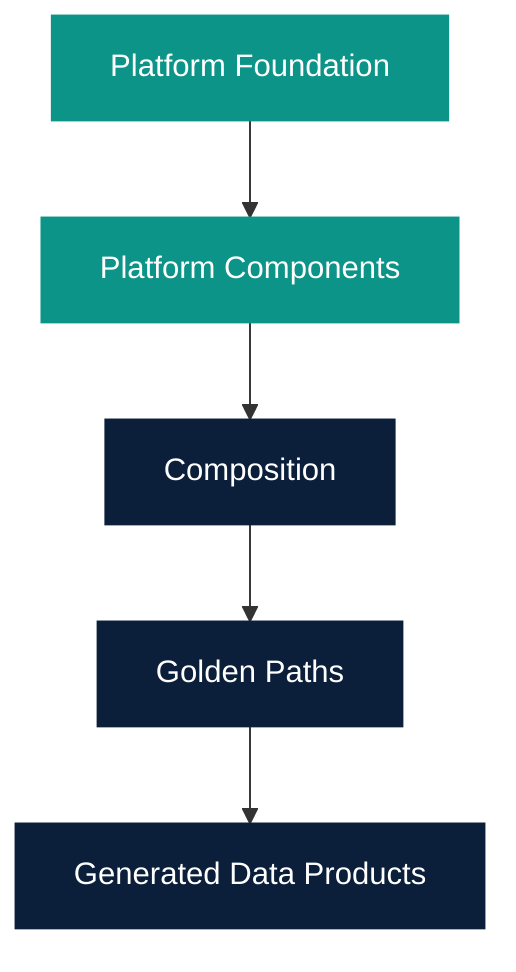

# Platform Component Library

Owner: Platform Team  
Last reviewed: 2026-08-21  
Audience: INTERNAL ENGINEERING  
Version: 1.0.0

**Build the domain logic. Reuse the platform.**

A **Platform Component** is a reusable technical capability used to
compose Data Products and Golden Paths. It is **not** a Data Product
and it is **not** a Backstage plugin.

Platform Components provide reusable integration, storage and
operational capabilities without coupling generated Data Products to
the Control Plane.

Browse the library: `/platform-components`.

Catalog type: `spec.type: platform-component`. Registry UI:
`/platform-components`. Catalog is the only component database.

| Category | Examples | Status in this phase |
| --- | --- | --- |
| Integration | REST Source, REST API, MQTT Consumer, Kafka Consumer/Producer, Unified Namespace | Wave 1 REST Source, REST API, and MQTT Consumer are **CERTIFIED** (technical only). UNS has a DEVELOPMENT runtime. Kafka is Catalog-only. |
| Data | PostgreSQL, Time-Series Storage, Object Storage | Time-Series Storage 1.0.0 is **CERTIFIED** (SQLite MVP). PostgreSQL and object storage remain Catalog-only. |
| Operations | Observability, Health, Audit | Wave 1 Health and Observability are **CERTIFIED**. Audit remains Catalog-only. |
| Intelligence | Document Loader, Chunker, Embeddings, Vector Store, Retriever, RAG, LLM Gateway, Knowledge Graph | PLANNED placeholders only. |
| Asset semantic | Asset Administration Shell Foundation | DEVELOPMENT runtime for asset/sensor metadata. Not CERTIFIED. Not a Data Product. |

OEE 1.0 Mode A reuses the six CERTIFIED Wave 1 runtimes.

MQTT Temperature and REST Equipment conceptually map to Wave 1
components. Their generated runtimes do **not** currently import those
packages.

See [Browse the library](browse.md), [Composition Builder](composer.md),
[Product model](product-model.md), [Decision model](decision-model.md),
[How to reuse a Component](using.md), [Composition](composition.md),
and [Component vs Backstage Plugin](vs-backstage-plugin.md).
