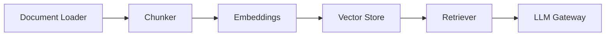
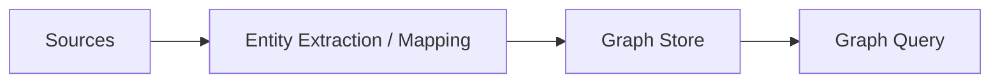
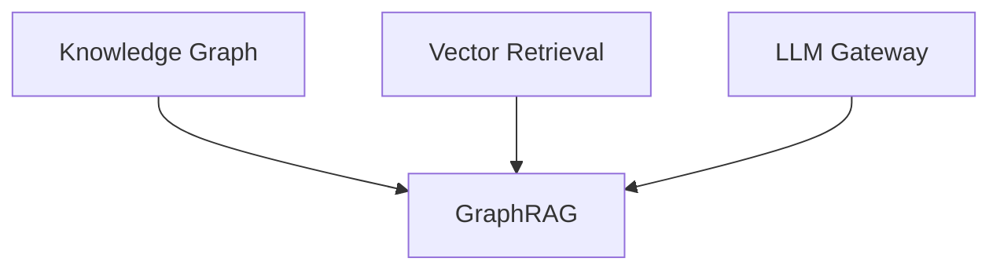

# Intelligence Foundation

Owner: Platform Team  
Last reviewed: 2026-08-20  
Audience: INTERNAL ENGINEERING  
Version: 1.0.0

Intelligence Platform Components are **PLANNED** Catalog placeholders.
Do not implement AI provider integrations, RAG runtimes, or graph stores
in this phase.

## RAG Foundation

## Knowledge Graph

## Future GraphRAG

Composition example: `catalog/artifacts/nexora/rag-foundation.yaml`.
Validation currently reports these components as unsupported (PLANNED).

When implemented, they will follow the same Platform Component Standard
as Health, Observability, REST API, REST Source, MQTT Consumer, and
Time-Series Storage (`spec.type: platform-component`, configuration
contract, conformance, technical certification).
