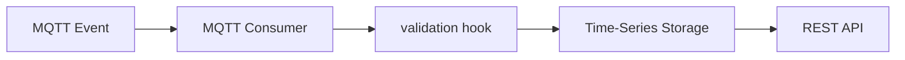

# Machine Metrics Reference

Owner: Platform Team  
Last reviewed: 2026-08-20  
Audience: INTERNAL ENGINEERING  
Version: 1.0.0

Composition proof, not a Golden Path and not OEE.



`GET /health`, `POST /api/v1/metrics`, `GET /api/v1/metrics/latest`, and
`GET /api/v1/metrics?entityId=...&metric=...` return generic machine
metrics:

```json
{
  "entityId": "machine-01",
  "metric": "cycle-time",
  "value": 12.4,
  "unit": "seconds",
  "timestamp": "2026-08-20T12:00:00Z"
}
```

Catalog `dependsOn`: mqtt-consumer, health, observability, timeseries, rest-api.

Catalog Graph: `/catalog-graph?rootEntityRefs=component:default/machine-metrics-reference`.
Used By on those components is derived from inverse `dependsOn`.

AAS lookup proof (does not change this runtime): `resolve_property("filler-01", "speed")`
returns unit `rpm` and MQTT topic
`pharma/basel/packaging/line-01/filler-01/speed/value`. Machine Metrics
does not depend on AAS at runtime.
