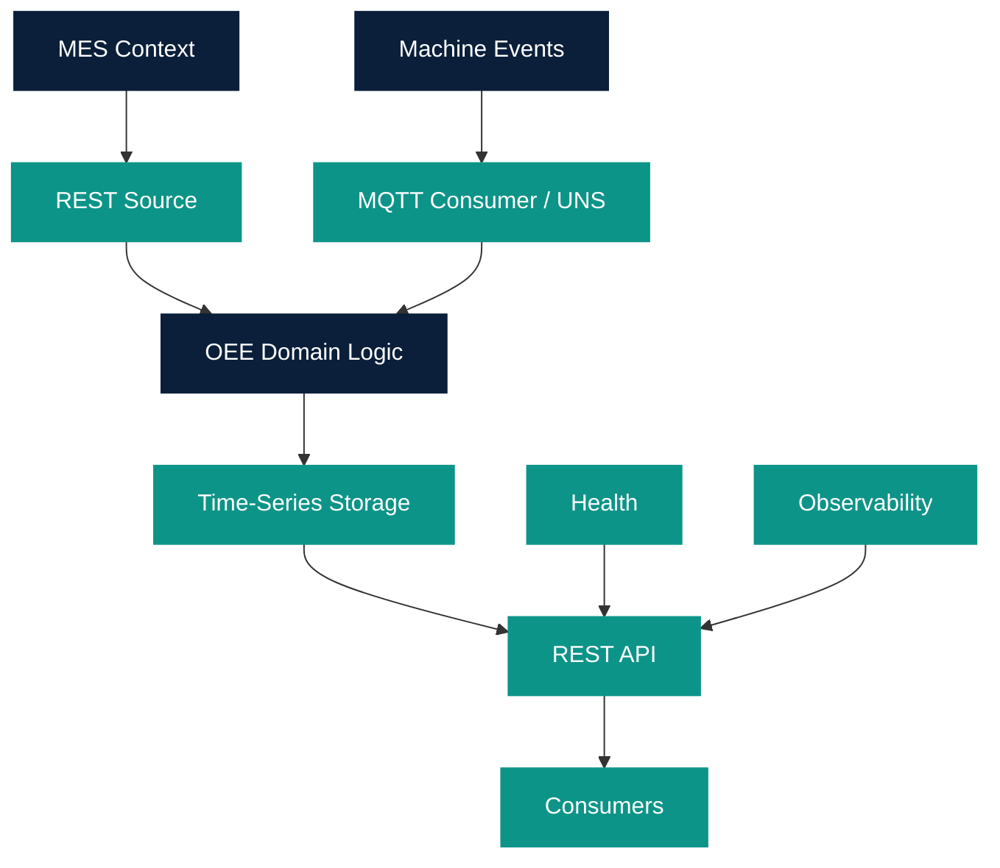

# OEE Composition Example

Owner: Platform Team  
Last reviewed: 2026-08-20  
Audience: INTERNAL ENGINEERING  
Version: 1.0.0

This is documentation and a composition example. **Do not calculate
OEE** here. OEE domain logic belongs in the OEE Data Product Golden Path
(`templates/oee-data-product`), not in a Platform Component.

Canonical domain, contracts, formulas, and Golden Path:
[OEE Golden Path Design 1.0](../oee/golden-path-design.md). Status:
**CERTIFIED** (technical only, not GxP). OEE 1.0 does not require Unified Namespace
(Mode A: MQTT Consumer; Mode B: UNS).

OEE consumes only approved TESTED or CERTIFIED Wave 1
Platform Components according to current platform policy:

- REST Source (MES/IT GET ingestion)
- MQTT Consumer and/or Unified Namespace (machine events)
- Time-Series Storage
- REST API
- Health
- Observability

Do **not** implement OEE inside Platform Components. See
[OEE Definition of Ready](oee-ready.md) and the Golden Path in
`templates/oee-data-product`.

Kafka infrastructure is not part of this composition.

Do **not** implement in this phase:

- Availability
- Performance
- Quality
- OEE %

OEE domain logic remains a future Golden Path. Health and Observability
are included so that future OEE inherits Wave 1 operations components.

Manifests: `catalog/compositions/oee-data-product.yaml` (Mode B example)
and `catalog/compositions/oee-data-product-direct.yaml` (Mode A).

Catalog placeholder `example-oee-data-product` `dependsOn` those
components so Catalog Graph can show native relations. Used By is
derived. Do not store inverse annotations.
