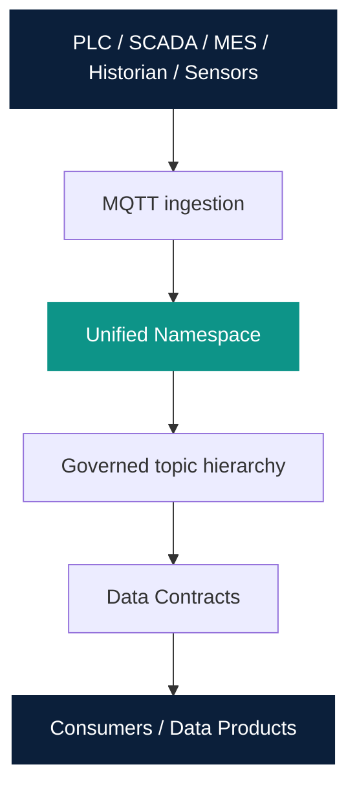

# UNS Architecture

Owner: Platform Team  
Last reviewed: 2026-08-20  
Audience: INTERNAL ENGINEERING  
Version: 1.0.0

MQTT is the first transport. `EventTransport` is the seam for a later
Kafka implementation. Do not add Kafka in this milestone.

Do not imply direct database access to MES, ERP, or LIMS.
