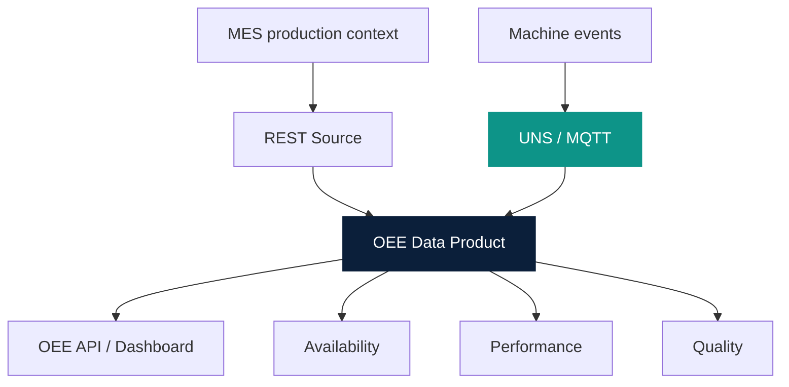

# OEE via Unified Namespace

Owner: Platform Team  
Last reviewed: 2026-08-20  
Audience: INTERNAL ENGINEERING  
Version: 1.0.0

Readiness only. **Do not calculate OEE in this phase.**

OEE 1.0 domain design: [OEE Domain & Contract Design](../oee/index.md).
Unified Namespace is optional (Mode B). Direct MQTT Consumer is Mode A.

Catalog: `example-oee-data-product` `dependsOn` `component:default/unified-namespace`.
That entity is an architectural placeholder, not a Golden Path.
