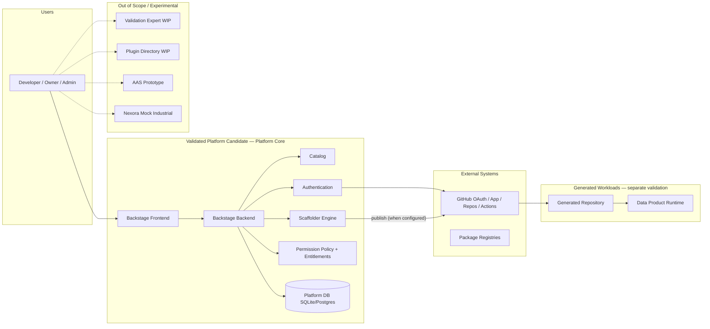

# System Boundary — CSV Phase 0 (PROPOSED)

| Field | Value |
| --- | --- |
| Document ID | PDF-CSV-P0-SB-001 |
| Status | PROPOSED — **GATE-03 System Boundary Approval** required |
| Product validation status | **NOT_VALIDATED** |
| Date | 2026-08-23 |

---

## 1. Boundary categories

### 1.1 Validated Platform Candidate (Baseline 0.1 — proposed)

Software and configuration that constitute the **Platform Core / Control Plane** candidate:

- Backstage frontend application (`packages/app`) as configured for Control Plane UX  
- Backstage backend (`packages/backend`) and registered **HEAD** plugins required for core operation  
- Authentication configuration (GitHub OAuth for shared/pilot; Guest policy decision)  
- Authorization / permission framework and platform permission policy  
- Software Catalog service + configured **non-sample** entity locations (samples separately controlled)  
- Scaffolder / Software Templates **engine** (not each template product content by default)  
- Platform configuration files and overlays used for the frozen environment  
- Core persistence (SQLite or PostgreSQL) used by Backstage plugins for catalog/auth/scaffolder state  
- Technical GitHub integration required for scaffolder publish and auth (as configured)  
- Entitlements backend **as access-control for create/commercial gates** (not AWS Marketplace product)  
- Marketplace UI **as discovery of templates** (not storefront checkout)  
- Data Products plugins **as catalog/CI metadata presentation** (technical statuses only)  
- `packages/platform-common` shared policy/permission helpers  

### 1.2 Generated Workloads

- Repositories and runtime services produced by Golden Paths / templates  
- Their CI pipelines, containers, databases, brokers, and plant integrations  
- Pilot harnesses under `pilot/`  

These are **downstream validation objects** (Layer 3), not Baseline 0.1 Platform Core.

### 1.3 External Systems

- GitHub.com (OAuth, Apps, repository hosting, Actions)  
- Container runtime / registries  
- npm/Yarn and PyPI package registries  
- PostgreSQL (when used) as infrastructure service  
- Identity claims from GitHub (IdP)  
- Optional remote industrial data sources (if Nexora remote mode enabled — out of Baseline 0.1 use)  

### 1.4 Out-of-Scope / Experimental (Baseline 0.1)

- Validation Expert (working-tree WIP; not in HEAD)  
- Plugin Directory (working-tree WIP; inventory only)  
- AAS in-memory adapter and `aas-asset` template  
- Nexora industrial **mock** operational use as GxP connectivity  
- OEE **commercial** offering / live marketplace sell motion  
- Unified Namespace as platform value proposition  
- Sample/demo catalog entities (must be isolated or excluded from validated discovery set)  
- Untracked design docs and experimental packages  

---

## 2. Mermaid — system context (proposed)

---

## 3. Trust boundaries (summary)

| Boundary | Description |
| --- | --- |
| User → Platform | Authenticated sessions; permission checks |
| Platform → GitHub | OAuth tokens / GitHub App credentials; least privilege required |
| Platform → DB | Local/network DB; backups not yet established as validated process |
| Platform → Generated workload | **No runtime control plane coupling required**; generated apps run independently |
| Platform → Experimental plugins | Must not be required for Baseline 0.1 intended use |

---

## 4. Human approval

| Gate | Decision |
| --- | --- |
| **GATE-03** | Approve system boundary categories and diagram |

**AI must not approve GATE-03.**
