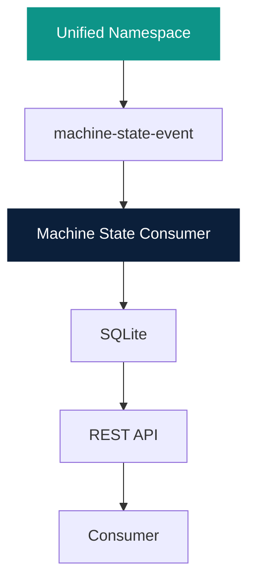

# Architecture

This product is independently deployable. Backstage is the Control Plane.
UNS and this consumer are Runtime / Data Plane.

MQTT is optional for local tests. `POST /api/v1/events` uses the same
validation and persistence path.
