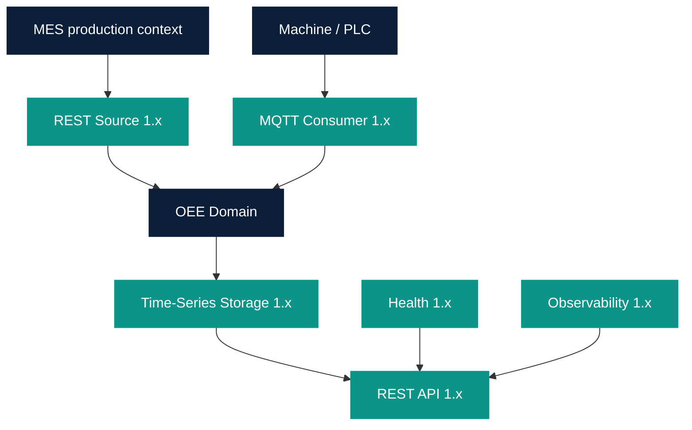

# Architecture

```mermaid
flowchart TB
  classDef navy fill:#0B1F3A,stroke:#0B1F3A,color:#ffffff
  classDef teal fill:#0D9488,stroke:#0D9488,color:#ffffff
  MES[MES production context] --> RS[REST Source 1.x]
  PLC[Machine / PLC] --> MQTT[MQTT Consumer 1.x]
  RS --> DOM[OEE Domain]
  MQTT --> DOM
  DOM --> TS[Time-Series Storage 1.x]
  TS --> API[REST API 1.x]
  H[Health 1.x] --> API
  OBS[Observability 1.x] --> API
  class MES,PLC,DOM navy
  class RS,MQTT,TS,API,H,OBS teal
```

Adapters in `app/ingestion/mappings.py` translate MES/PLC payloads to canonical
contracts. The calculator does not know SAP or PLC tag names.
