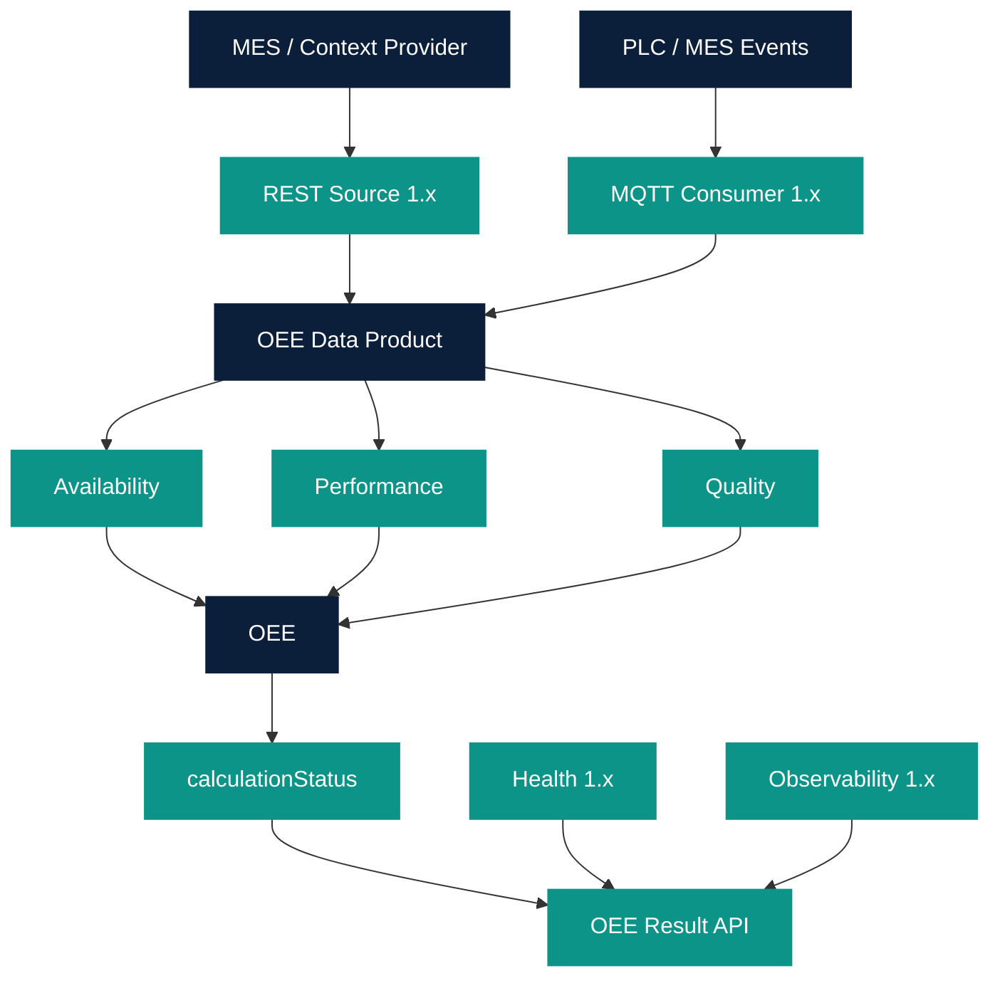

# Architecture

```text
                MES / Context Provider
                        │
                       REST
                        │
                        ▼

PLC / MES Events → MQTT → OEE DATA PRODUCT
                           │
                    ┌──────┼──────┐
                    │      │      │
                    ▼      ▼      ▼
                    A      P      Q
                    │      │      │
                    └──────┼──────┘
                           ▼
                          OEE
                           │
                           ▼
                 calculationStatus
                           │
                           ▼
                    OEE Result API
```



Adapters in `app/ingestion/mappings.py` translate MES/PLC payloads to canonical
contracts. The calculator does not know SAP or PLC tag names. Unobserved time
is excluded from planned production time; it is not converted into `STOPPED`.
`reasonCode` does not enter Availability, Performance, Quality, or OEE.
MES remains System of Record. No direct core-system database access.
