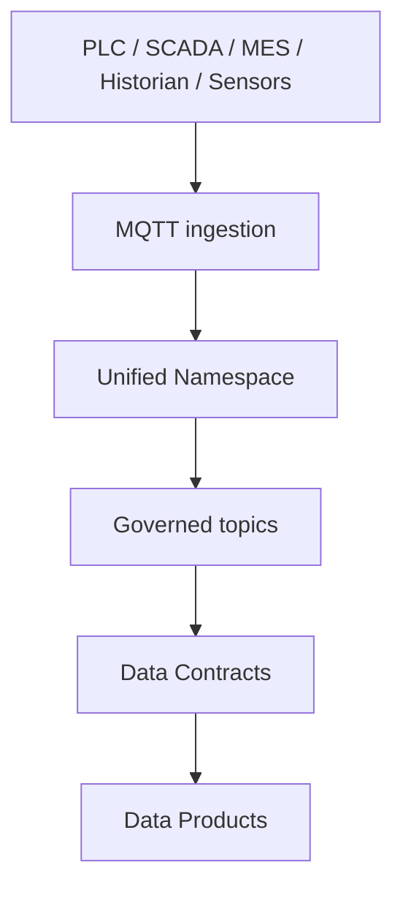

# Unified Namespace

Owner: Platform Team  
Last reviewed: 2026-08-20  
Audience: INTERNAL ENGINEERING  
Version: 1.0.0

Reusable **platform component** for a governed MQTT event namespace.
This is not a Data Product.



Local development:

```bash
docker compose up --build
pip install -e ".[dev]"
python examples/publish_examples.py
python examples/consume.py
pytest
```

Default topic pattern:

```text
{root}/{site}/{area}/{line}/{equipment}/{domain}/{event}
```

See Nexora Developer Hub for architecture, namespace
convention, event envelope, producer/consumer guides, and OEE / Cold
Chain readiness (no business logic in this component).
